# Microservice Design – CAB System

> Tài liệu thiết kế Microservice dựa trên `srs.md` (CAB System – ABC).
> Phương pháp: **Domain-Driven Design (DDD)** – xác định Bounded Context bằng Event Storming trên các quy trình nghiệp vụ ở mục 6 và các Entity ở mục 9 của SRS, sau đó ánh xạ **1 Bounded Context = 1 Microservice = 1 Database**.

---

## 1. Nguyên tắc thiết kế

| # | Nguyên tắc | Áp dụng trong tài liệu này |
|---|---|---|
| 1 | Bounded Context được xác định theo **ranh giới nghiệp vụ** (business capability), không theo bảng dữ liệu | 14 Bounded Context được tách từ 6 quy trình nghiệp vụ + 19 Entity trong SRS |
| 2 | Mỗi Bounded Context có **Ubiquitous Language** riêng – cùng một khái niệm nhưng khác nghĩa/khác tên ở Context khác | Ví dụ: `Booking` (yêu cầu, chưa có tài xế) ở Booking Context khác với `Trip` (đang thực hiện) ở Trip Context |
| 3 | **1 Bounded Context ↔ 1 Microservice** | Bảng mục 3 |
| 4 | **1 Microservice ↔ 1 Database**, không truy cập trực tiếp DB của service khác (Database-per-Service) | Giao tiếp chỉ qua API/Event, không qua shared DB |
| 5 | Mỗi Microservice có **mô hình dữ liệu (ERD) riêng**, được rút gọn từ ERD tổng ở mục 9.2 SRS – chỉ giữ field cần cho nghiệp vụ của Context đó, tham chiếu sang Context khác bằng **ID** (không có Foreign Key vật lý xuyên service) | Mục 4 |
| 6 | **Chọn loại DB (SQL/NoSQL/Cache/Search/OLAP) phù hợp với đặc tính dữ liệu và tải** của từng Context, không dùng một loại DB cho tất cả | Mục 4 + bảng tổng hợp mục 7 |

---

## 2. Bounded Context Map (tổng quan)

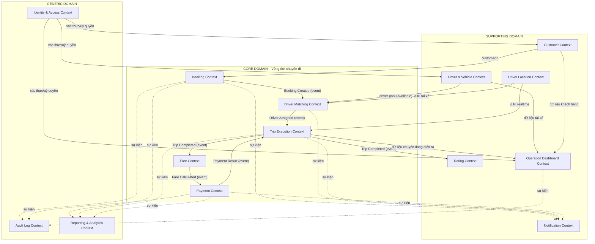

**Ghi chú Context Mapping (kiểu quan hệ DDD):**

| Nguồn (Upstream) | Đích (Downstream) | Kiểu quan hệ | Cơ chế |
|---|---|---|---|
| Booking Context | Driver Matching Context | Customer–Supplier | Async event (`BookingCreated`) |
| Driver & Vehicle Context, Driver Location Context | Driver Matching Context | Conformist (đọc dữ liệu tài xế đã chuẩn hoá) | API đồng bộ (query) + event |
| Driver Matching Context | Trip Execution Context | Customer–Supplier | Async event (`DriverAssigned`) |
| Trip Execution Context | Fare Context | Customer–Supplier | Async event (`TripCompleted`) |
| Fare Context | Payment Context | Customer–Supplier | Async event (`FareCalculated`) |
| Payment/Notification/Map(ngoài) | Toàn hệ thống | Anti-Corruption Layer (ACL) | Adapter riêng trong từng service tích hợp Provider ngoài, cô lập lỗi (NFR-14, NFR-34/35/36) |
| Tất cả Context nghiệp vụ | Audit Log Context | Shared Kernel về sự kiện (Event Schema chung) | Async event publish, mỗi service tự log |
| Tất cả Context nghiệp vụ | Reporting Context | Open Host Service (event feed công khai) | Async event → ETL/stream vào kho OLAP |
| Tất cả Context nghiệp vụ | Identity & Access Context | Conformist (mọi service phải theo chuẩn token/role của IAM) | API xác thực (JWT/OAuth2) |

---

## 3. Bảng ánh xạ Bounded Context → Microservice → Database

| # | Bounded Context | Microservice (API) | Loại Database | Vì sao (tóm tắt – xem chi tiết mục 4) |
|---|---|---|---|---|
| 1 | Identity & Access | `identity-service` | **PostgreSQL** | Quan hệ N-N User/Role/Permission, cần ACID, toàn vẹn bảo mật |
| 2 | Customer Management | `customer-service` | **PostgreSQL** | Dữ liệu hồ sơ có cấu trúc, cần transaction khi cập nhật |
| 3 | Driver & Vehicle Management | `driver-service` | **PostgreSQL** | Quan hệ Driver 1–N Vehicle, cần ràng buộc dữ liệu chặt |
| 4 | Driver Location (Geo-Tracking) | `location-service` | **Redis (Geospatial)** | Ghi/đọc tần suất rất cao, gần thời gian thực, truy vấn khoảng cách (GEO), dữ liệu có TTL |
| 5 | Booking | `booking-service` | **PostgreSQL** | Vòng đời trạng thái booking phải nhất quán (ACID), không được mất booking |
| 6 | Driver Matching | `matching-service` | **PostgreSQL** (+ Redis cache runtime) | Lưu lịch sử phân công (audit), cần transaction khi xác nhận 1 tài xế duy nhất (EX-05) |
| 7 | Trip Execution | `trip-service` | **PostgreSQL** | State machine tuần tự nghiêm ngặt (mục 8.2 SRS), cần ACID |
| 8 | Fare Calculation | `fare-service` | **PostgreSQL** | Quy tắc giá có cấu trúc, cần join FareRule–ServiceType, cần audit số tiền |
| 9 | Payment | `payment-service` | **PostgreSQL** | Dữ liệu tài chính, bắt buộc ACID + Idempotency (NFR-38, EX-13) |
| 10 | Notification | `notification-service` | **MongoDB** | Payload khác nhau theo từng kênh/provider (SMS/Email/Push) → schema linh hoạt, ghi nhiều |
| 11 | Rating | `rating-service` | **PostgreSQL** | Dữ liệu đơn giản, cần ràng buộc "1 Trip – 1 Rating" (unique constraint) |
| 12 | Operation Dashboard | `operation-service` | **Elasticsearch** | Cần tìm kiếm/lọc/tổng hợp nhanh nhiều chiều dữ liệu vận hành gần real-time |
| 13 | Reporting & Analytics | `reporting-service` | **ClickHouse (OLAP columnar)** | Truy vấn tổng hợp khối lượng lớn (doanh thu, tỷ lệ hoàn thành...) theo thời gian |
| 14 | Audit Log | `audit-service` | **Cassandra** | Ghi rất nhiều, append-only, không update, cần scale ngang & lưu trữ dài hạn |

> Nguyên tắc Database-per-Service được giữ nghiêm ngặt: các service **không** join trực tiếp qua DB của nhau. Mọi liên kết giữa các entity (VD: `Trip.driverId` tham chiếu `Driver`) chỉ là **ID tham chiếu logic**, dữ liệu chi tiết được lấy qua API hoặc được nhân bản cục bộ (local read-model) qua event.

---

## 4. Chi tiết từng Bounded Context

### 4.1. Identity & Access Context

**Trách nhiệm nghiệp vụ:** Xác thực (Authentication), phân quyền (Authorization/RBAC), quản lý tài khoản người dùng cho mọi vai trò (Customer, Driver, Operation Staff, Admin, Finance). Tương ứng UC-01 (một phần), UC-02, UC-14; FR-01–06, FR-75–76; BR-01, BR-23; NFR-20–22, NFR-27.

**Ubiquitous Language:**

| Thuật ngữ | Ý nghĩa trong Context này |
|---|---|
| `User` | Tài khoản đăng nhập hệ thống (không chứa hồ sơ nghiệp vụ chi tiết – hồ sơ nằm ở Customer/Driver Context) |
| `Role` | Vai trò (Customer, Driver, Operation, Admin, Finance) |
| `Permission` | Một hành động cụ thể được phép thực hiện (VD: `trip:read`, `role:manage`) |
| `Session/Token` | Phiên đăng nhập (JWT), có thời hạn (NFR-27) |
| `Authorization Check` | Hành động kiểm tra quyền trước khi cho phép gọi API (FR-76) |

**Microservice:** `identity-service`
**Aggregate Root:** `User` (chứa danh sách `Role` được gán)

**Database:** **PostgreSQL**
*Lý do:* quan hệ N-N (`User`–`Role`, `Role`–`Permission`) cần JOIN chính xác; dữ liệu bảo mật đòi hỏi ACID tuyệt đối; khối lượng ghi không quá lớn nên không cần NoSQL scale ngang.

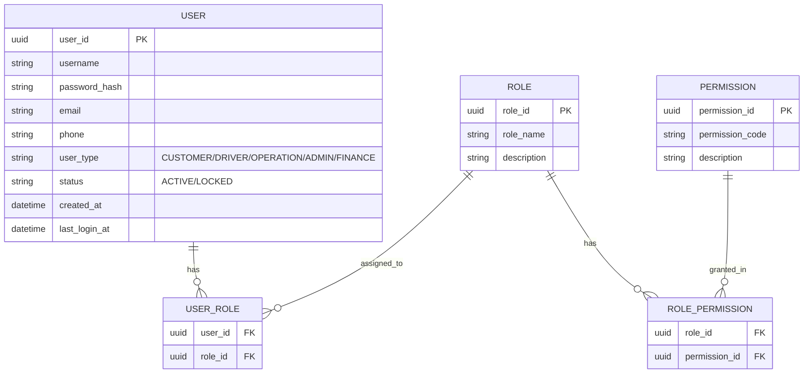

**API chính:** `POST /auth/register`, `POST /auth/login`, `POST /auth/logout`, `GET /users/{id}`, `POST /roles`, `POST /roles/{id}/permissions`, `GET /users/{id}/permissions` (dùng nội bộ cho các service khác kiểm tra quyền).

---

### 4.2. Customer Management Context

**Trách nhiệm nghiệp vụ:** Hồ sơ khách hàng, cập nhật thông tin cá nhân. UC-01; FR-04, FR-63; BR-01; NFR-24, NFR-29–30.

**Ubiquitous Language:**

| Thuật ngữ | Ý nghĩa |
|---|---|
| `Customer` | Hồ sơ nghiệp vụ của khách hàng (không lưu password – tham chiếu `userId` sang Identity Context) |
| `Profile` | Thông tin cá nhân: họ tên, email, địa chỉ liên hệ |
| `Account Status` | Trạng thái tài khoản khách hàng (Active/Suspended) do Operation quản lý |

**Microservice:** `customer-service`
**Aggregate Root:** `Customer`

**Database:** **PostgreSQL**
*Lý do:* dữ liệu có cấu trúc rõ, ít thay đổi schema, cần transaction khi Operation cập nhật/khoá tài khoản, dễ dàng truy vấn/báo cáo về sau.

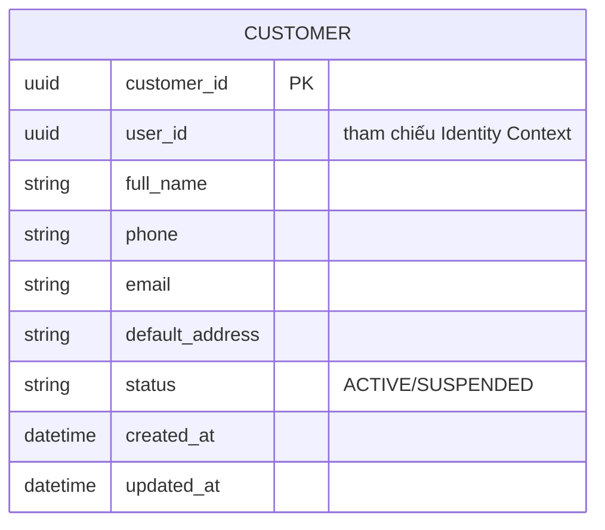

**API chính:** `POST /customers`, `GET /customers/{id}`, `PUT /customers/{id}`, `PUT /customers/{id}/status` (Operation dùng để khoá/mở khoá).

---

### 4.3. Driver & Vehicle Management Context

**Trách nhiệm nghiệp vụ:** Hồ sơ tài xế, quản lý phương tiện, trạng thái sẵn sàng. UC-01, UC-04 (một phần); FR-05, FR-07–09, FR-11–12, FR-64–65; BR-02–03; NFR-24.

**Ubiquitous Language:**

| Thuật ngữ | Ý nghĩa |
|---|---|
| `Driver` | Hồ sơ nghiệp vụ tài xế (license, đánh giá trung bình, trạng thái hoạt động) |
| `Vehicle` | Phương tiện do 1 Driver sở hữu/sử dụng |
| `VehicleType` | Danh mục loại xe/dịch vụ (VD: 4 chỗ, 7 chỗ, Bike) |
| `Availability Status` | `Available` / `Unavailable` — chỉ tài xế `Available` mới được đưa vào tìm kiếm (BR-02) |

**Microservice:** `driver-service`
**Aggregate Root:** `Driver` (chứa danh sách `Vehicle`)

**Database:** **PostgreSQL**
*Lý do:* quan hệ Driver 1–N Vehicle, Vehicle N–1 VehicleType cần ràng buộc toàn vẹn (không thể gán loại xe không tồn tại); trạng thái Available/Unavailable cần cập nhật có kiểm soát tranh chấp (concurrency) khi Matching Service đọc.

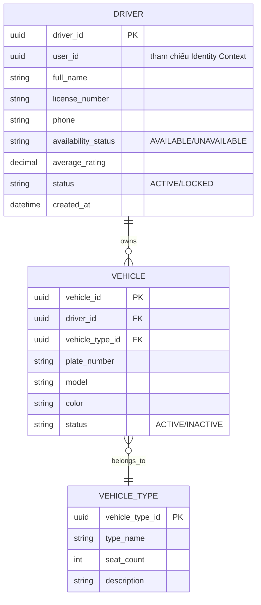

**API chính:** `POST /drivers`, `GET /drivers/{id}`, `PATCH /drivers/{id}/availability`, `POST /drivers/{id}/vehicles`, `GET /drivers?status=AVAILABLE&vehicleType=...` (Matching Service dùng để lấy danh sách ứng viên).

---

### 4.4. Driver Location (Geo-Tracking) Context

**Trách nhiệm nghiệp vụ:** Tiếp nhận, lưu và truy vấn vị trí tài xế theo thời gian gần thực để hỗ trợ tìm tài xế và hiển thị ETA. UC-04, UC-06/07; FR-10, FR-34; BR-06, BR-28; NFR-05, NFR-25, NFR-31.

**Ubiquitous Language:**

| Thuật ngữ | Ý nghĩa |
|---|---|
| `Position` | Toạ độ (lat, lng) hiện tại của 1 Driver |
| `Geo Index` | Cấu trúc chỉ mục không gian phục vụ tìm kiếm theo bán kính |
| `Proximity Search` | Truy vấn "tài xế nào gần điểm đón trong bán kính X" |
| `Staleness` | Vị trí được xem là "cũ" nếu không cập nhật quá ngưỡng thời gian cấu hình (EX-09) |

**Microservice:** `location-service`
**Aggregate Root:** `DriverLocation` (theo `driverId`, luôn giữ bản ghi mới nhất)

**Database:** **Redis (Geospatial – lệnh `GEOADD`/`GEOSEARCH`) + Redis Stream/Sorted Set cho lịch sử ngắn hạn**
*Lý do:*
- Tần suất ghi cực cao (mỗi tài xế cập nhật vị trí mỗi 5–10s theo NFR-05) → cần DB in-memory tốc độ cao.
- Cần truy vấn bán kính (geo query) hiệu năng cao cho Matching Context – Redis GEO hỗ trợ sẵn.
- Dữ liệu vị trí "hiện tại" có tính chất tạm thời, có thể đặt TTL (EX-09: giữ vị trí cuối nếu mất kết nối), không cần ACID quan hệ phức tạp như các Context khác.
- Nếu cần lưu lịch sử dài hạn phục vụ báo cáo, dữ liệu sẽ được stream sang `reporting-service` (ClickHouse) qua event, không lưu trong Redis.

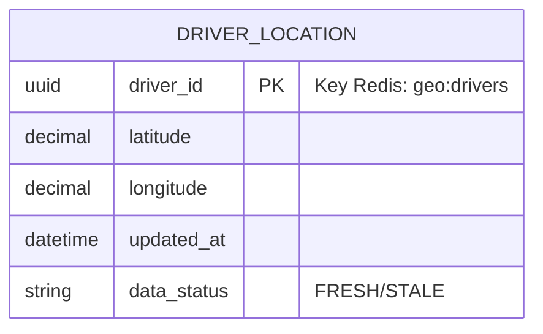

**API chính:** `POST /locations/{driverId}` (driver app gửi vị trí), `GET /locations/nearby?lat=&lng=&radiusKm=&vehicleType=` (Matching Service gọi), `GET /locations/{driverId}` (Trip/Operation dùng hiển thị ETA).

---

### 4.5. Booking Context

**Trách nhiệm nghiệp vụ:** Tiếp nhận yêu cầu đặt xe từ khách hàng, quản lý vòng đời booking cho tới khi có tài xế hoặc bị huỷ/không tìm được tài xế. UC-03; FR-13–19; BR-16, BR-18; EX-06, EX-18; NFR-02.

**Ubiquitous Language:**

| Thuật ngữ | Ý nghĩa |
|---|---|
| `Booking` | Yêu cầu đặt xe **trước khi** có tài xế xác nhận (khác với `Trip` ở Trip Context – là chuyến **đã có** tài xế và đang thực hiện) |
| `Pickup Point` / `Dropoff Point` | Điểm đón / điểm đến |
| `Requested Vehicle Type` | Loại xe khách hàng chọn |
| `Booking Status` | `REQUESTED → SEARCHING → DRIVER_ASSIGNED/NO_DRIVER/CANCELLED` (theo mục 8.2 SRS, phần trước khi Trip Context tiếp quản) |

**Microservice:** `booking-service`
**Aggregate Root:** `Booking`

**Database:** **PostgreSQL**
*Lý do:* đây là entry-point của toàn bộ nghiệp vụ — "không được làm mất booking" (nguyên tắc mục 8.4 SRS) đòi hỏi ghi dữ liệu có ACID tuyệt đối; trạng thái phải nhất quán để tránh race-condition khi nhiều tiến trình cùng cập nhật.

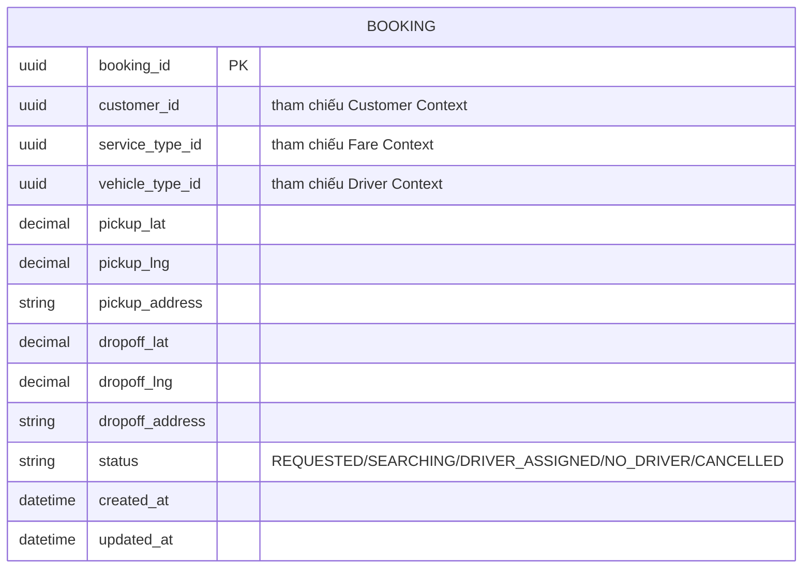

**API chính:** `POST /bookings`, `GET /bookings/{id}`, `PATCH /bookings/{id}/cancel`, `GET /bookings/{id}/status`. Phát sự kiện `BookingCreated`, `BookingCancelled` cho Matching/Notification/Audit/Reporting.

---

### 4.6. Driver Matching Context

**Trách nhiệm nghiệp vụ:** Lọc, xếp hạng và gửi yêu cầu tới tài xế phù hợp; xử lý reject/timeout, chuyển tài xế tiếp theo. UC-04; FR-20–28; BR-04–09; EX-01–05.

**Ubiquitous Language:**

| Thuật ngữ | Ý nghĩa |
|---|---|
| `Matching Request` | Một lần hệ thống tìm tài xế cho 1 Booking |
| `Candidate Driver` | Tài xế thoả điều kiện lọc (Available, đúng loại xe, trong bán kính) |
| `Assignment Attempt` | 1 lần gửi yêu cầu tới 1 tài xế cụ thể (có thể có nhiều attempt cho 1 booking) |
| `Ranking Score` | Điểm ưu tiên tài xế theo tiêu chí nghiệp vụ (khoảng cách, rating...) |
| `Timeout` | Khoảng thời gian tài xế được phép phản hồi trước khi hệ thống chuyển sang ứng viên khác |

**Microservice:** `matching-service`
**Aggregate Root:** `DriverAssignment`

**Database:** **PostgreSQL** (dữ liệu record-of-truth cho lịch sử phân công) — **kết hợp Redis làm cache runtime** để giữ danh sách driver pool đang "in-flight" cho một booking, tránh 2 tài xế cùng được xác nhận (EX-05); Redis ở đây chỉ là lớp cache tạm thời, **không phải nguồn dữ liệu chính (system of record)**, nên không vi phạm nguyên tắc 1 service – 1 database.
*Lý do chọn PostgreSQL làm DB chính:* cần transaction "chỉ 1 tài xế được xác nhận" (SELECT... FOR UPDATE / optimistic lock) và cần lưu lại lịch sử matching phục vụ audit/báo cáo hiệu quả tài xế (FR-74).

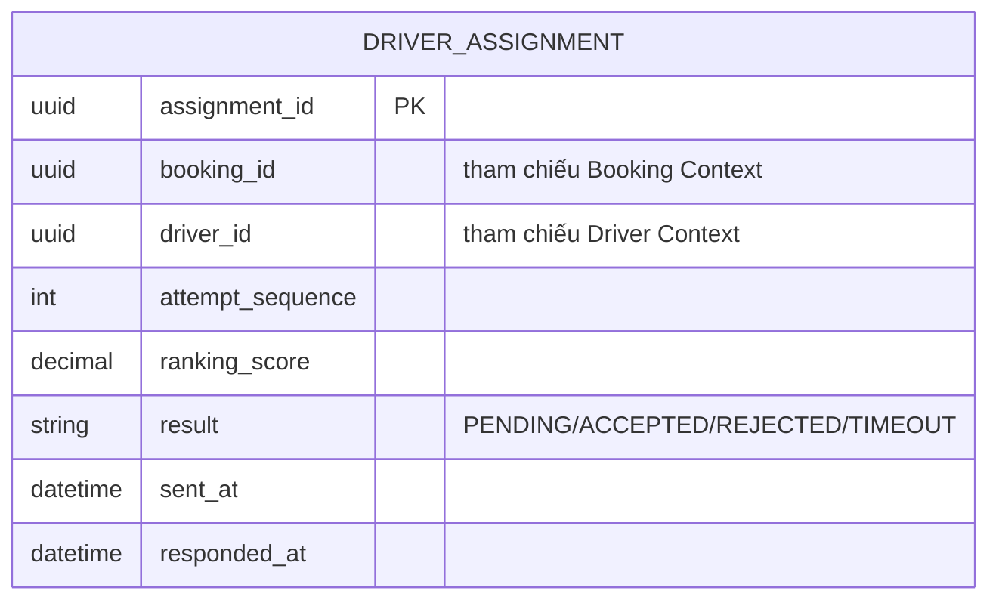

**API chính:** (chủ yếu nội bộ, kích hoạt bởi event `BookingCreated`) `POST /matching/{bookingId}/start`, `POST /matching/{bookingId}/drivers/{driverId}/accept`, `POST /matching/{bookingId}/drivers/{driverId}/reject`. Phát sự kiện `DriverAssigned`, `NoDriverFound`.

---

### 4.7. Trip Execution Context

**Trách nhiệm nghiệp vụ:** Quản lý vòng đời chuyến đi **sau khi** đã có tài xế: tới điểm đón, đón khách, di chuyển, hoàn thành. UC-05, UC-06, UC-07; FR-29–37; BR-10–12; EX-08, EX-19.

**Ubiquitous Language:**

| Thuật ngữ | Ý nghĩa |
|---|---|
| `Trip` | Chuyến đi **đã có tài xế xác nhận**, đối tượng chính của Context này (khác `Booking`) |
| `Trip Status` | `DRIVER_ASSIGNED → DRIVER_ARRIVED → PASSENGER_PICKED_UP → IN_PROGRESS → COMPLETED/CANCELLED` |
| `ETA` | Thời gian dự kiến đến, được tính dựa trên vị trí từ Location Context |
| `Trip Timeline` | Lịch sử các mốc thời gian chuyển trạng thái của 1 Trip |

**Microservice:** `trip-service`
**Aggregate Root:** `Trip`

**Database:** **PostgreSQL**
*Lý do:* state machine phải tuân thủ tuần tự nghiêm ngặt theo bảng mục 8.2 SRS — cần ràng buộc và transaction để chặn transition không hợp lệ (VD: TC "cập nhật trạng thái sai thứ tự"); đây là dữ liệu lõi cần ACID và truy vết đầy đủ.

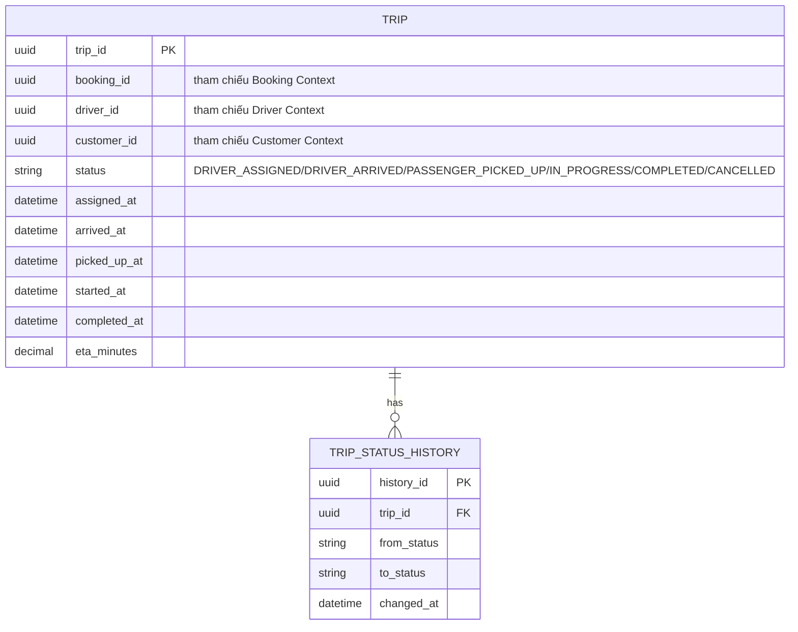

**API chính:** `PATCH /trips/{id}/status`, `GET /trips/{id}`, `GET /trips/{id}/history`, `GET /trips?status=IN_PROGRESS` (Operation Context dùng). Phát sự kiện `TripArrived`, `TripStarted`, `TripCompleted`, `TripCancelled`.

---

### 4.8. Fare Calculation Context

**Trách nhiệm nghiệp vụ:** Tính cước sau khi Trip hoàn thành, áp dụng đúng công thức theo loại dịch vụ. UC-08; FR-38–41; BR-13.

**Ubiquitous Language:**

| Thuật ngữ | Ý nghĩa |
|---|---|
| `Fare` | Số tiền được tính cho 1 Trip cụ thể |
| `FareRule` | Cấu hình công thức tính giá (giá mở cửa, đơn giá/km, đơn giá/phút...) |
| `ServiceType` | Loại hình dịch vụ áp dụng FareRule tương ứng |
| `Base Fare` / `Surcharge` | Giá mở cửa / phụ phí (giờ cao điểm, khu vực...) |

**Microservice:** `fare-service`
**Aggregate Root:** `Fare`

**Database:** **PostgreSQL**
*Lý do:* FareRule và ServiceType là dữ liệu có cấu trúc, quan hệ N–1 cần JOIN chính xác; số tiền tính ra cần lưu vết để đối soát tài chính (audit), đòi hỏi tính nhất quán cao hơn NoSQL.

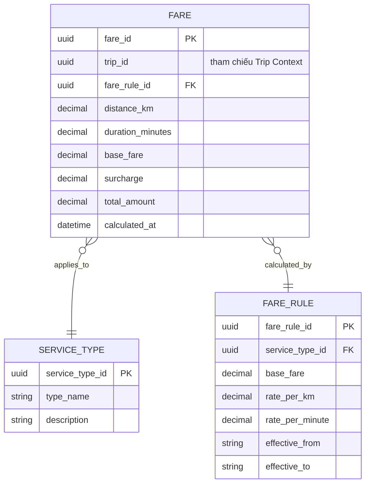

**API chính:** `POST /fares/calculate` (kích hoạt bởi event `TripCompleted`), `GET /fares/{tripId}`, `POST /fare-rules`, `GET /fare-rules?serviceType=`. Phát sự kiện `FareCalculated`.

---

### 4.9. Payment Context

**Trách nhiệm nghiệp vụ:** Thanh toán tiền mặt/điện tử, xử lý thất bại và retry, không lưu dữ liệu nhạy cảm. UC-09; FR-42–48; BR-14–17, BR-27; EX-11–13; NFR-26, NFR-38.

**Ubiquitous Language:**

| Thuật ngữ | Ý nghĩa |
|---|---|
| `Payment` | 1 giao dịch thanh toán cho 1 Trip |
| `PaymentMethod` | Phương thức (Cash/Card/E-Wallet...) |
| `Transaction Reference` | Mã tham chiếu duy nhất dùng để chống trùng giao dịch (Idempotency Key – EX-13) |
| `Payment Status` | `PENDING → SUCCESS/FAILED → (RETRY)` |

**Microservice:** `payment-service`
**Aggregate Root:** `Payment`

**Database:** **PostgreSQL**
*Lý do:* dữ liệu tài chính bắt buộc ACID; cần ràng buộc UNIQUE trên `transaction_reference` để đảm bảo Idempotency (NFR-38, EX-13); không lưu số thẻ/thông tin nhạy cảm (BR-27) — chỉ lưu token/trạng thái do Payment Provider trả về.

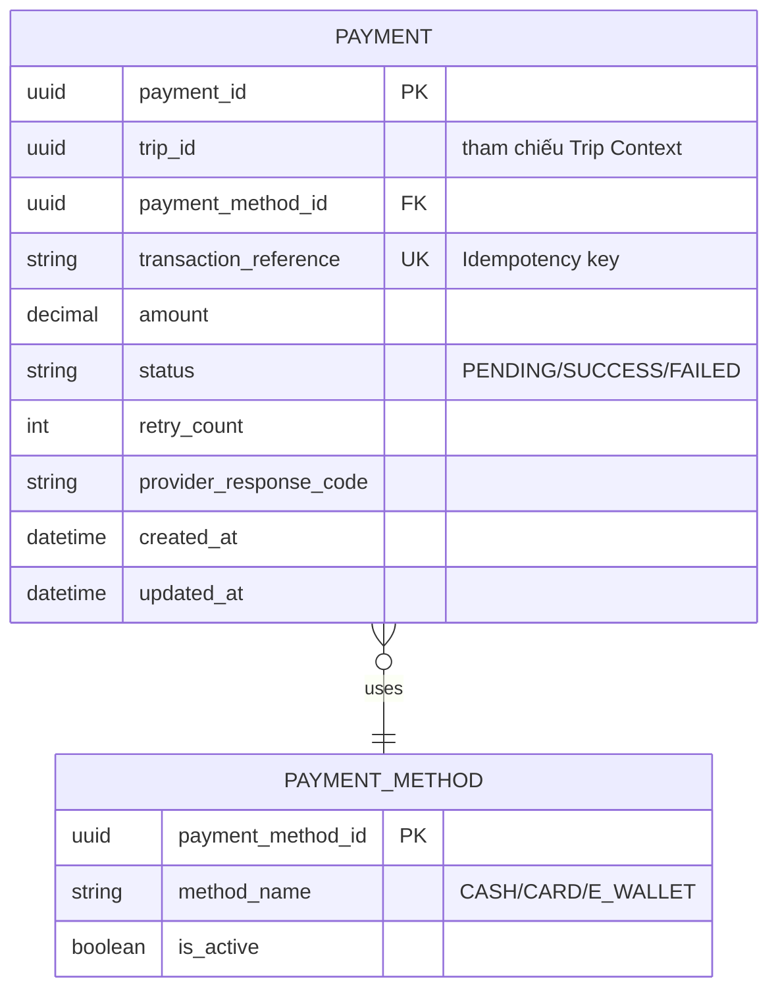

**API chính:** `POST /payments`, `POST /payments/{id}/retry`, `GET /payments/{tripId}`, `POST /payments/webhook` (callback từ Payment Provider – Anti-Corruption Layer). Phát sự kiện `PaymentSucceeded`, `PaymentFailed`.

---

### 4.10. Notification Context

**Trách nhiệm nghiệp vụ:** Gửi thông báo qua nhiều kênh cho các sự kiện quan trọng của chuyến. UC-10; FR-49–56; BR-22; EX-14; NFR-35, NFR-47.

**Ubiquitous Language:**

| Thuật ngữ | Ý nghĩa |
|---|---|
| `Notification` | 1 bản ghi thông báo đã/đang gửi tới 1 người nhận |
| `Channel` | Kênh gửi: SMS/Email/Push |
| `Delivery Status` | `QUEUED/SENT/FAILED` |
| `Template` | Mẫu nội dung theo loại sự kiện |

**Microservice:** `notification-service`
**Aggregate Root:** `Notification`

**Database:** **MongoDB**
*Lý do:* mỗi kênh (SMS/Email/Push) và mỗi Provider có payload/metadata khác nhau (schema-less phù hợp hơn bảng cố định); khối lượng ghi lớn (mọi sự kiện của mọi Trip đều sinh thông báo) nhưng không cần transaction phức tạp; không có quan hệ N-N cần JOIN.

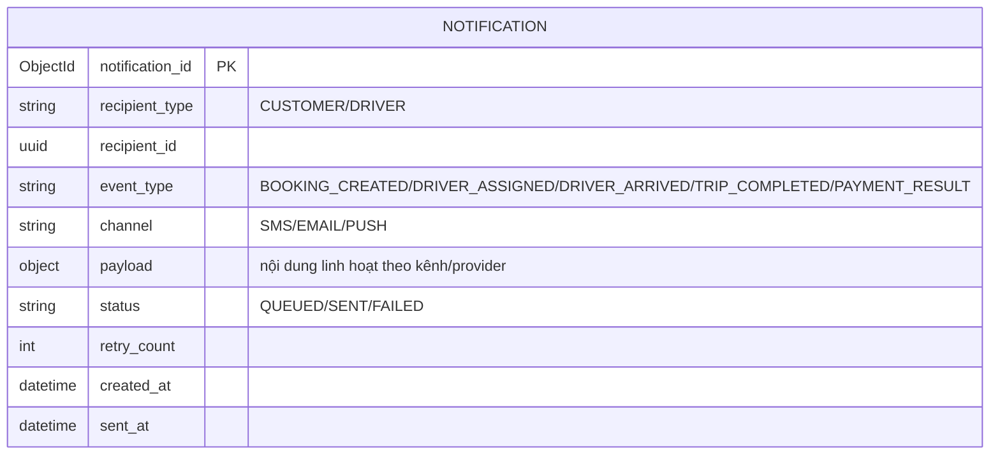

**API chính:** `POST /notifications/send` (kích hoạt bởi các event từ Booking/Matching/Trip/Payment), `GET /notifications?recipientId=`. Không phát sự kiện tiếp (leaf service), lỗi được cô lập theo nguyên tắc Fault Isolation (NFR-35).

---

### 4.11. Rating Context

**Trách nhiệm nghiệp vụ:** Khách hàng đánh giá tài xế sau khi Trip hoàn thành. UC-11; FR-60–61; BR-20–21.

**Ubiquitous Language:**

| Thuật ngữ | Ý nghĩa |
|---|---|
| `Rating` | Đánh giá (điểm số + nhận xét) của khách hàng cho 1 Trip đã COMPLETED |
| `Reviewed Trip` | Trip đã được đánh giá — mỗi Trip chỉ được đánh giá 1 lần (trừ khi doanh nghiệp cho sửa) |

**Microservice:** `rating-service`
**Aggregate Root:** `Rating`

**Database:** **PostgreSQL**
*Lý do:* cấu trúc dữ liệu đơn giản nhưng cần ràng buộc `UNIQUE(trip_id)` để đảm bảo "một đánh giá cho một chuyến" (BR-21), phù hợp với constraint quan hệ.

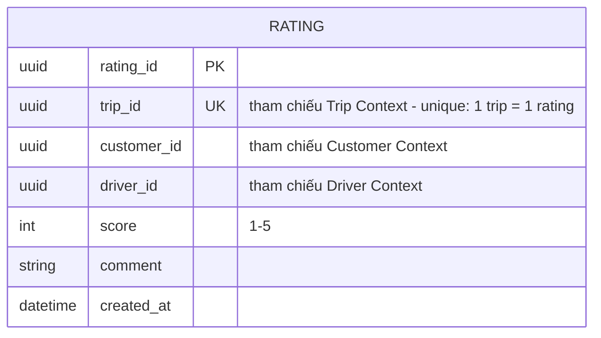

**API chính:** `POST /ratings`, `GET /ratings/driver/{driverId}`, `GET /ratings/{tripId}`. Phát sự kiện `DriverRated` (Driver Context cập nhật `average_rating`).

---

### 4.12. Operation Dashboard Context

**Trách nhiệm nghiệp vụ:** Nhân viên vận hành theo dõi tổng quan các chuyến đang diễn ra, khách hàng, tài xế và xử lý sự cố. UC-12; FR-62–69; BR (mục 8.4); EX-19–20.

**Ubiquitous Language:**

| Thuật ngữ | Ý nghĩa |
|---|---|
| `Dashboard` | Màn hình tổng quan hiển thị trạng thái hệ thống theo thời gian gần thực |
| `Ongoing Trip View` | Bản sao dữ liệu chuyến đang diễn ra, tổng hợp từ nhiều Context để tra cứu nhanh |
| `Incident/Case` | Trường hợp bất thường cần Operation can thiệp (chuyến bị treo, thanh toán lỗi...) |

**Microservice:** `operation-service`
**Aggregate Root:** `OperationalTripView` (read-model), `IncidentCase`

**Database:** **Elasticsearch**
*Lý do:* Context này chủ yếu phục vụ **CQRS read-model** — tìm kiếm/lọc/tổng hợp nhanh trên nhiều tiêu chí (theo khách hàng, tài xế, trạng thái, khoảng thời gian) với khối lượng dữ liệu lớn và yêu cầu độ trễ thấp cho dashboard (NFR-06: <=3s); Elasticsearch tối ưu cho full-text search + filter + aggregation, tốt hơn PostgreSQL khi cần dashboard linh hoạt nhiều chiều mà không cần ACID (dữ liệu là bản sao, nguồn gốc thật vẫn ở Booking/Trip/Payment Context).

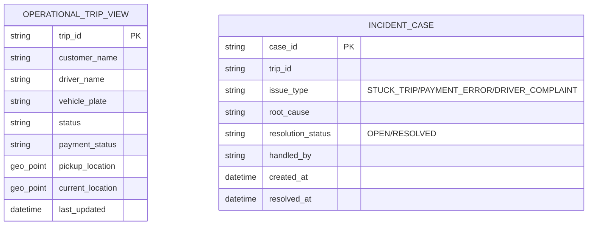

**API chính:** `GET /operations/trips?status=&keyword=`, `GET /operations/dashboard/summary`, `POST /operations/incidents`, `PATCH /operations/incidents/{id}/resolve`. Dữ liệu được đồng bộ (indexed) liên tục từ event của Booking/Trip/Payment/Driver Context.

---

### 4.13. Reporting & Analytics Context

**Trách nhiệm nghiệp vụ:** Báo cáo số chuyến, doanh thu, tỷ lệ hoàn thành/huỷ, hiệu quả tài xế. UC-13; FR-70–74; BR-11 (RTM); NFR ở mục 10.9 (Observability liên quan).

**Ubiquitous Language:**

| Thuật ngữ | Ý nghĩa |
|---|---|
| `KPI` | Chỉ số đo lường (doanh thu, completion rate, cancellation rate...) |
| `Time Window` | Khoảng thời gian tổng hợp báo cáo (ngày/tuần/tháng) |
| `Fact/Aggregation` | Dữ liệu sự kiện thô được tổng hợp thành số liệu báo cáo |

**Microservice:** `reporting-service`
**Aggregate Root:** không có aggregate nghiệp vụ (đây là kho dữ liệu chỉ-đọc, tổng hợp qua ETL/event streaming)

**Database:** **ClickHouse (OLAP – Columnar Store)**
*Lý do:* các truy vấn báo cáo là truy vấn tổng hợp (SUM/COUNT/AVG theo thời gian) trên khối lượng dữ liệu lịch sử rất lớn (toàn bộ Trip/Payment theo thời gian) — cơ sở dữ liệu cột (columnar) cho hiệu năng tổng hợp vượt trội so với OLTP truyền thống, phù hợp khối lượng ghi dạng append (event) và đọc dạng phân tích.

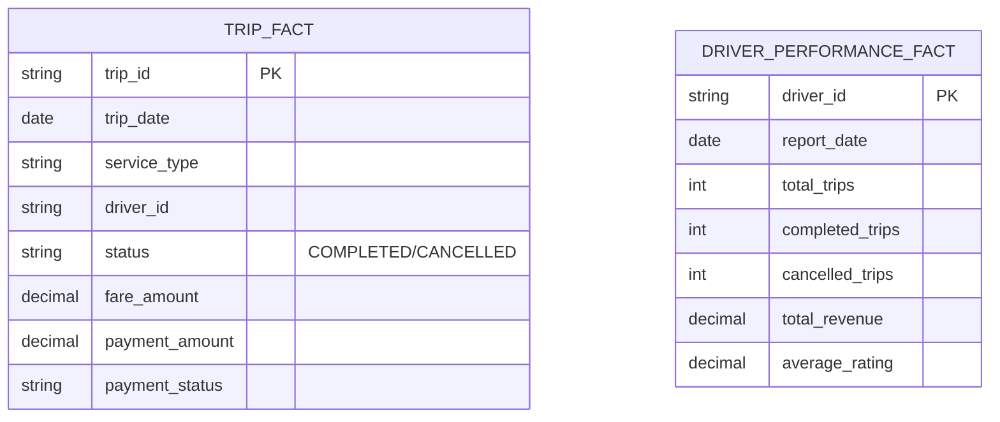

**API chính:** `GET /reports/trips?from=&to=`, `GET /reports/revenue?from=&to=&serviceType=`, `GET /reports/completion-rate`, `GET /reports/driver-performance`.

---

### 4.14. Audit Log Context

**Trách nhiệm nghiệp vụ:** Ghi vết mọi thao tác quan trọng/nhạy cảm của người dùng và hệ thống để phục vụ kiểm tra, điều tra sự cố. UC-15; FR-77–78; BR-24–25; NFR-28, NFR-51–56.

**Ubiquitous Language:**

| Thuật ngữ | Ý nghĩa |
|---|---|
| `Audit Event` | 1 bản ghi hành động đã xảy ra (bất biến – không được sửa/xoá) |
| `Actor` | Người/hệ thống thực hiện hành động |
| `Resource` | Đối tượng bị tác động (Booking, Trip, Payment, Role...) |
| `Trace ID` | Mã dùng để truy vết 1 booking xuyên suốt các service (NFR-55) |

**Microservice:** `audit-service`
**Aggregate Root:** `AuditLog` (append-only, immutable)

**Database:** **Cassandra**
*Lý do:* đặc tính ghi rất lớn, liên tục, **chỉ ghi – không cập nhật** (append-only), cần lưu trữ dài hạn và truy vấn theo thời gian/actor hiệu quả trên diện rộng — Cassandra (wide-column, phân vùng theo thời gian) tối ưu cho write-heavy time-series và có khả năng scale ngang không giới hạn, phù hợp hơn PostgreSQL khi khối lượng log tăng theo toàn bộ hoạt động hệ thống.

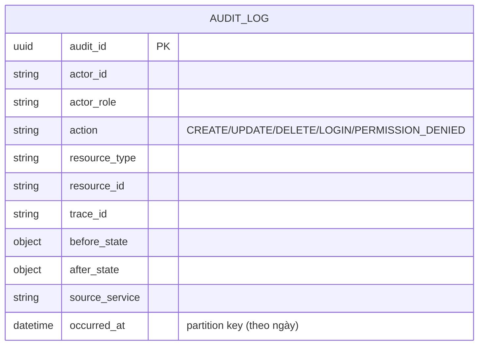

**API chính:** `POST /audit-logs` (nội bộ, mọi service khác gọi hoặc publish event), `GET /audit-logs?actor=&resource=&from=&to=`, `GET /audit-logs/trace/{traceId}`.

---

## 5. Giao tiếp giữa các Microservice – Saga cho luồng đặt xe end-to-end

Luồng nghiệp vụ chính (mục 6.1 SRS) đi xuyên qua 6 Bounded Context lõi. Vì mỗi service có DB riêng, tính nhất quán được đảm bảo bằng **Choreography-based Saga** (mỗi service lắng nghe event và tự thực hiện transaction cục bộ, không có 2-phase commit xuyên service):

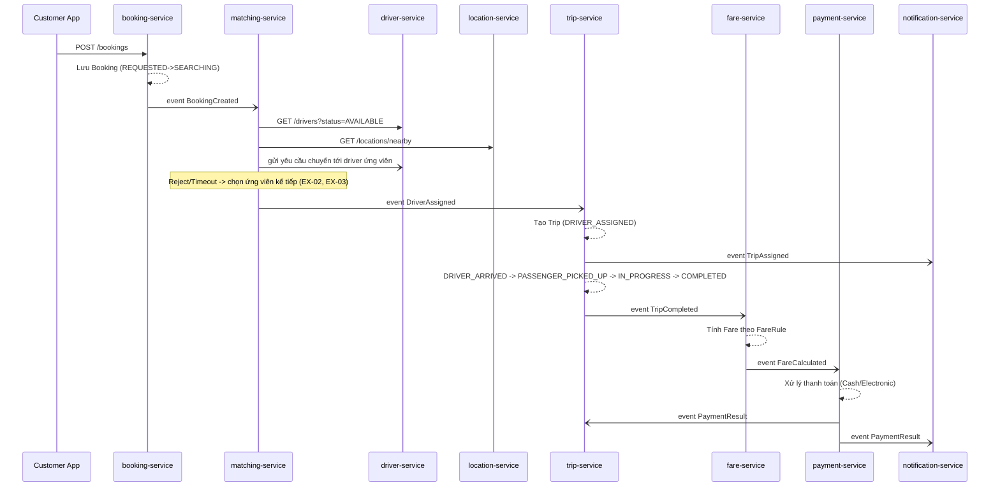

**Nguyên tắc chịu lỗi áp dụng cho Saga (đối chiếu mục 8.4 SRS):**
- Mỗi bước là 1 transaction cục bộ trong DB riêng của service đó — không transaction phân tán xuyên service.
- Lỗi ở Notification/Payment (external) được cô lập bằng Anti-Corruption Layer + Retry + Circuit Breaker, không làm rollback booking/trip đã tạo (NFR-14, NFR-34/35).
- Idempotency Key bắt buộc ở `payment-service` để chống xử lý trùng khi Saga retry (EX-13, NFR-38).
- `audit-service` và `reporting-service` chỉ là **subscriber** của toàn bộ event trên, không nằm trong đường Saga chính, không ảnh hưởng luồng nghiệp vụ nếu tạm thời chậm.

---

## 6. Bảng tổng hợp cuối cùng

| Bounded Context | Microservice | Aggregate Root chính | Loại Database | Nhóm DB |
|---|---|---|---|---|
| Identity & Access | `identity-service` | User | PostgreSQL | Relational (OLTP) |
| Customer Management | `customer-service` | Customer | PostgreSQL | Relational (OLTP) |
| Driver & Vehicle Management | `driver-service` | Driver | PostgreSQL | Relational (OLTP) |
| Driver Location | `location-service` | DriverLocation | Redis (Geospatial) | In-memory / Cache |
| Booking | `booking-service` | Booking | PostgreSQL | Relational (OLTP) |
| Driver Matching | `matching-service` | DriverAssignment | PostgreSQL (+Redis cache runtime) | Relational (OLTP) |
| Trip Execution | `trip-service` | Trip | PostgreSQL | Relational (OLTP) |
| Fare Calculation | `fare-service` | Fare | PostgreSQL | Relational (OLTP) |
| Payment | `payment-service` | Payment | PostgreSQL | Relational (OLTP) |
| Notification | `notification-service` | Notification | MongoDB | Document (NoSQL) |
| Rating | `rating-service` | Rating | PostgreSQL | Relational (OLTP) |
| Operation Dashboard | `operation-service` | OperationalTripView / IncidentCase | Elasticsearch | Search & Analytics |
| Reporting & Analytics | `reporting-service` | (read-only fact tables) | ClickHouse | OLAP Columnar |
| Audit Log | `audit-service` | AuditLog | Cassandra | Wide-column (NoSQL) |

**Tóm tắt lựa chọn công nghệ DB (polyglot persistence):**

| Loại DB | Dùng cho | Đặc tính khai thác |
|---|---|---|
| PostgreSQL | Identity, Customer, Driver, Booking, Matching, Trip, Fare, Payment, Rating | Cần ACID, quan hệ rõ ràng, transaction, ràng buộc dữ liệu chặt (unique, FK logic) |
| Redis | Driver Location | Ghi/đọc cực nhanh, truy vấn không gian địa lý, dữ liệu tạm thời có TTL |
| MongoDB | Notification | Schema linh hoạt theo kênh/provider, ghi khối lượng lớn, không cần JOIN phức tạp |
| Elasticsearch | Operation Dashboard | Tìm kiếm/lọc/tổng hợp đa chiều, độ trễ thấp cho dashboard, dữ liệu là read-model |
| ClickHouse | Reporting & Analytics | Truy vấn tổng hợp (SUM/AVG/COUNT) trên dữ liệu lịch sử khối lượng lớn |
| Cassandra | Audit Log | Ghi append-only rất lớn, phân vùng theo thời gian, scale ngang, lưu trữ dài hạn |

---

## 7. Ánh xạ ngược lại Entity trong SRS (mục 9.1) → Bounded Context

| Entity (SRS) | Bounded Context sở hữu |
|---|---|
| E01 `Customer` | Customer Management |
| E02 `Driver` | Driver & Vehicle Management |
| E03 `Vehicle` | Driver & Vehicle Management |
| E04 `VehicleType` | Driver & Vehicle Management |
| E05 `Booking` | Booking |
| E06 `Trip` | Trip Execution |
| E07 `DriverAssignment` | Driver Matching |
| E08 `DriverLocation` | Driver Location |
| E09 `Fare` | Fare Calculation |
| E10 `Payment` | Payment |
| E11 `PaymentMethod` | Payment |
| E12 `Notification` | Notification |
| E13 `Rating` | Rating |
| E14 `User` | Identity & Access |
| E15 `Role` | Identity & Access |
| E16 `Permission` | Identity & Access |
| E17 `AuditLog` | Audit Log |
| E18 `FareRule` | Fare Calculation |
| E19 `ServiceType` | Fare Calculation |

> Entity không xuất hiện trực tiếp (`OperationalTripView`, `IncidentCase`, các bảng Fact báo cáo) là **read-model / dữ liệu tổng hợp**, được sinh ra từ event của các Entity gốc ở trên, không phải nguồn dữ liệu chính (system of record).
