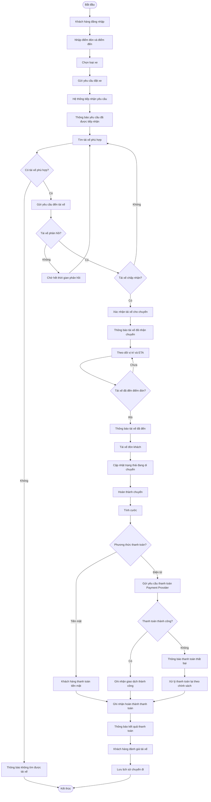

b1: xacs ddinh bussiness contact nguwx canh nghiepj vuj

business problem

mucj ddichs laf gif

gias trij cuaj ht nayf taoj ra so voiws ht cux

Xác định các stalkhoder?
Lập bảng 
c1: những stalkhoder 
c2 vai trò 
vẽ ma trận stakhoder () mức đọ ảnh  hưởng cảu các vai trò trong hệ thống
3.
bs goals :bg01: hỗ trợ thanh toán (= tiền mặt ....)
bg02: giảm time tìm tài xế(tìm tài tự động, gần nhất
4.
scope_Phạm vi
(ql đc khách hang, quản lý tài xế,...) 
không thuộc trong scope(Dung ai tìm dương ngắn nhất, xử lý nhu cầu kh,...) phải deal vs kh
5. Xác nhận lại với kh chuyển đổi thành business requirements
6. business process -quy trình nghiệp vụ dùng công cụ mermaid trong markdown
7. Functional Requirement 
- 
8. business rule và Exception
9. mô hình hóa dữ liệu, xác định các thực thể
10. yêu cầu phi chức năng
# 1. Business Context – Ngữ cảnh nghiệp vụ
   ABC là doanh nghiệp cung cấp dịch vụ đặt xe trực tuyến, trong đó có 3 nhóm người dùng chính:

      Customer – người có nhu cầu đặt xe.
      Driver – tài xế cung cấp dịch vụ vận chuyển.
      Operation Staff – nhân viên vận hành/quản trị hệ thống.
      
   Ngoài ra, hệ thống còn tương tác với các hệ thống bên ngoài:
      
      Payment Provider – nhà cung cấp thanh toán điện tử.
      Notification Provider – SMS/Email/Push Notification.
      Có thể có Map/Location Service để hỗ trợ vị trí, khoảng cách, ETA.
      Các hệ thống báo cáo/BI trong tương lai.

   Ngữ cảnh hiện tại: hệ thống cũ còn phụ thuộc nhiều vào tổng đài và thao tác thủ công, đặc biệt trong việc phân công tài xế, theo dõi chuyến và quản lý thanh toán.
   
                         
   # 1.2. Business Problem – Vấn đề kinh doanh
      Hệ thống đặt xe hiện tại phụ thuộc nhiều vào thao tác thủ công và chưa có khả năng quản lý tập trung toàn bộ vòng đời chuyến xe, dẫn đến hiệu quả điều phối thấp, trải nghiệm khách hàng hạn chế, khó kiểm soát thanh toán và dữ liệu vận hành, đồng thời làm giảm khả năng mở rộng dịch vụ của ABC.
      Hệ thống cũ có 6 vấn đề đang hiện hành:
        Phân công tài xế thủ công: Chậm xử lý booking, tăng chi phí vận hành
        Khó theo dõi trạng thái chuyến: Khách hàng thiếu thông tin, tăng cuộc gọi đến tổng đài
        Quản lý thanh toán chưa tập trung: Khó kiểm soát doanh thu và giao dịch
        Dữ liệu khách hàng/tài xế/chuyến đi phân tán: Khó quản lý và báo cáo
        Hệ thống khó mở rộng: Khó đáp ứng khi số lượng booking tăng
        Phụ thuộc vào một hệ thống/luồng xử lý: Một lỗi có thể ảnh hưởng toàn bộ dịch vụ

   # 1.3. Mục đích – Business Purpose
      Xây dựng một nền tảng CAB tập trung nhằm tự động hóa quy trình đặt và điều phối xe, nâng cao trải nghiệm khách hàng, tăng hiệu quả vận hành và tạo nền tảng công nghệ có khả năng mở rộng cho các dịch vụ vận tải trong tương lai.
   # 1.4. Giá trị của CAB System so với hệ thống cũ

| **Khía cạnh** | **Hệ thống cũ** | **CAB System mới** | **Giá trị tạo ra** |
|---|---|---|---|
| **Đặt xe** | Đặt qua tổng đài hoặc ứng dụng đơn giản | Đặt xe trực tiếp trên nền tảng | Số hóa và đơn giản hóa quy trình đặt xe |
| **Phân công tài xế** | Chủ yếu thực hiện thủ công | Tự động tìm và phân công tài xế phù hợp | Giảm thời gian và chi phí vận hành |
| **Tìm tài xế** | Khó xác định tài xế phù hợp/gần khách | Dựa trên vị trí, trạng thái và tiêu chí vận hành | Tăng hiệu quả điều phối |
| **Tài xế từ chối/không phản hồi** | Có thể phải xử lý thủ công lại | Tự động chuyển sang tài xế tiếp theo | Giảm thời gian chờ, hạn chế mất booking |
| **Theo dõi chuyến đi** | Khách hàng ít thông tin về trạng thái | Theo dõi trạng thái và ETA của chuyến | Tăng tính minh bạch và trải nghiệm khách hàng |
| **Vị trí tài xế** | Chưa được khai thác hiệu quả | Cập nhật và lưu thông tin vị trí | Hỗ trợ tìm tài xế và dự kiến thời gian đến |
| **Quản lý chuyến đi** | Thông tin phân tán, khó tra cứu | Quản lý tập trung toàn bộ vòng đời chuyến | Dễ kiểm soát và xử lý sự cố |
| **Tính cước** | Chưa được quản lý tập trung | Tự động tính cước theo loại dịch vụ và thông tin chuyến | Giảm sai sót, tăng tính nhất quán |
| **Thanh toán** | Chưa tập trung | Hỗ trợ tiền mặt và thanh toán điện tử | Quản lý giao dịch và doanh thu tốt hơn |
| **Xử lý thanh toán lỗi** | Khó kiểm soát và đối soát | Có trạng thái giao dịch và cơ chế xử lý lại | Giảm rủi ro thất thoát doanh thu |
| **Thông báo** | Hạn chế | Thông báo theo từng sự kiện của chuyến | Cải thiện trải nghiệm khách hàng và tài xế |
| **Dữ liệu** | Phân tán | Tập trung dữ liệu khách hàng, tài xế, xe, chuyến, thanh toán | Dễ tra cứu, đối soát và phân tích |
| **Quản lý vận hành** | Phụ thuộc nhiều vào thao tác thủ công | Có hệ thống quản trị riêng | Tăng năng suất nhân viên vận hành |
| **Báo cáo** | Khó tổng hợp | Dashboard và báo cáo về chuyến, doanh thu, hủy, hiệu quả tài xế | Hỗ trợ ra quyết định dựa trên dữ liệu |
| **Bảo mật** | Khả năng kiểm soát hạn chế | Authentication, Authorization và Audit Log | Tăng mức độ an toàn và khả năng kiểm tra |
| **Khả năng mở rộng** | Khó đáp ứng khi số lượng khách/tài xế tăng | Có khả năng scale các thành phần độc lập | Hỗ trợ tăng trưởng kinh doanh |
| **Khả năng tích hợp** | Khó tích hợp thêm dịch vụ | Có thể tích hợp Payment, Map, Notification Provider | Dễ mở rộng hệ sinh thái |
| **Khả năng thay đổi** | Thay đổi một chức năng có thể ảnh hưởng hệ thống | Kiến trúc modular, giảm coupling | Giảm chi phí và rủi ro phát triển tương lai |
| **Xử lý sự cố** | Một lỗi có thể ảnh hưởng nhiều chức năng | Có khả năng cô lập các thành phần như Payment/Notification | Tăng tính ổn định và khả năng phục hồi |
| **Phát triển sản phẩm mới** | Khó bổ sung dịch vụ mới | Có nền tảng để thêm loại xe/dịch vụ/phương thức thanh toán | Tạo nền tảng cho phát triển dài hạn |

## Tóm tắt giá trị

### Hệ thống cũ

> Đặt xe → Xử lý thủ công → Khó theo dõi → Dữ liệu phân tán → Khó mở rộng

### CAB System mới

> Đặt xe → Tự động tìm tài xế → Theo dõi chuyến → Tính cước → Thanh toán → Đánh giá → Báo cáo

### Giá trị kinh doanh kỳ vọng

- Giảm chi phí vận hành.
- Tăng năng lực phục vụ khách hàng.
- Nâng cao trải nghiệm khách hàng.
- Tăng hiệu quả điều phối tài xế.
- Tăng khả năng kiểm soát và phân tích dữ liệu.
- Tăng tính ổn định và khả năng mở rộng.
- Tạo nền tảng để phát triển thêm dịch vụ trong tương lai.
  
# 2. Stakeholders

| **C1: Stakeholder** | **C2: Vai trò** |
|---|---|
| **Ban giám đốc / Business Owner** | Định hướng kinh doanh, phê duyệt ngân sách, xác định mục tiêu và đánh giá hiệu quả dự án |
| **Khách hàng (Customer)** | Đăng ký, đặt xe, theo dõi chuyến, thanh toán, xem lịch sử và đánh giá tài xế |
| **Tài xế (Driver)** | Nhận/từ chối chuyến, cập nhật trạng thái chuyến, cập nhật vị trí và thông tin phương tiện |
| **Nhân viên vận hành (Operation Staff)** | Quản lý khách hàng, tài xế, phương tiện, theo dõi chuyến và xử lý các trường hợp bất thường |
| **Quản trị hệ thống (System Admin)** | Quản lý tài khoản, phân quyền, cấu hình và bảo mật hệ thống |
| **Bộ phận chăm sóc khách hàng (CS)** | Tiếp nhận và xử lý yêu cầu, khiếu nại, hỗ trợ khách hàng trong quá trình sử dụng dịch vụ |
| **Bộ phận tài chính / kế toán** | Theo dõi thanh toán, đối soát giao dịch, doanh thu và báo cáo tài chính |
| **Business Analyst (BA)** | Thu thập, phân tích, làm rõ và quản lý yêu cầu nghiệp vụ |
| **Project Manager (PM)** | Quản lý phạm vi, tiến độ, nguồn lực, rủi ro và phối hợp các bên |
| **Development Team** | Phân tích kỹ thuật, thiết kế và phát triển hệ thống CAB |
| **QA / Tester** | Kiểm thử chức năng, nghiệp vụ, hiệu năng và đảm bảo chất lượng hệ thống |
| **DevOps / Infrastructure** | Triển khai, vận hành, giám sát và đảm bảo khả năng mở rộng hệ thống |
| **Payment Provider** | Cung cấp dịch vụ thanh toán điện tử và xử lý giao dịch thanh toán |
| **Notification Provider** | Cung cấp dịch vụ gửi Push Notification, SMS, Email hoặc các kênh thông báo khác |
| **Map/GPS Provider** | Cung cấp dữ liệu bản đồ, vị trí, khoảng cách và hỗ trợ tính ETA |
| **Cơ quan quản lý / Pháp lý** | Đảm bảo hệ thống tuân thủ các quy định về vận tải, thanh toán và bảo vệ dữ liệu |

# 2.1. Ma trận Stakeholder – Mức độ ảnh hưởng

| **Stakeholder** | **Mức độ ảnh hưởng** | **Mức độ quan tâm** | **Chiến lược quản lý** |
|---|---|---|---|
| **Ban giám đốc / Business Owner** | 🔴 Cao | 🔴 Cao | **Manage Closely** – Tham gia quyết định, cập nhật thường xuyên |
| **Nhân viên vận hành (Operation)** | 🔴 Cao | 🔴 Cao | **Manage Closely** – Tham gia sâu vào phân tích nghiệp vụ |
| **Khách hàng (Customer)** | 🟠 Trung bình | 🔴 Cao | **Keep Informed** – Thu thập feedback và kiểm tra trải nghiệm |
| **Tài xế (Driver)** | 🟠 Trung bình | 🔴 Cao | **Keep Informed** – Thu thập nhu cầu và phản hồi |
| **System Admin** | 🔴 Cao | 🟠 Trung bình | **Keep Satisfied** – Đảm bảo quyền quản trị và bảo mật |
| **Bộ phận Tài chính / Kế toán** | 🟠 Trung bình | 🟠 Trung bình | **Keep Satisfied** – Đảm bảo yêu cầu thanh toán, đối soát |
| **Bộ phận CS** | 🟠 Trung bình | 🔴 Cao | **Keep Informed** – Đảm bảo chức năng hỗ trợ khách hàng |
| **Business Analyst (BA)** | 🔴 Cao | 🔴 Cao | **Manage Closely** – Phân tích và quản lý yêu cầu |
| **Project Manager (PM)** | 🔴 Cao | 🔴 Cao | **Manage Closely** – Quản lý tiến độ, phạm vi và rủi ro |
| **Development Team** | 🟠 Trung bình | 🔴 Cao | **Keep Informed / Collaborate** |
| **QA / Tester** | 🟢 Thấp – Trung bình | 🔴 Cao | **Keep Informed** – Đảm bảo chất lượng và nghiệp vụ |
| **DevOps / Infrastructure** | 🔴 Cao | 🟠 Trung bình – Cao | **Keep Satisfied / Collaborate** |
| **Payment Provider** | 🟠 Trung bình | 🟠 Trung bình | **Keep Satisfied** – Quản lý tích hợp và giao dịch |
| **Notification Provider** | 🟢 Thấp – Trung bình | 🟠 Trung bình | **Monitor / Keep Satisfied** |
| **Map/GPS Provider** | 🟠 Trung bình | 🟠 Trung bình | **Keep Satisfied** – Đảm bảo dữ liệu vị trí và ETA |
| **Cơ quan quản lý / Pháp lý** | 🔴 Cao | 🟠 Trung bình | **Keep Satisfied** – Đảm bảo tuân thủ pháp luật |

## Ma trận Power – Interest
  # 3. Ma trận Stakeholder – Power / Interest

| **Mức độ ảnh hưởng / Mức độ quan tâm** | **Thấp** | **Cao** |
|---|---|---|
| **Cao** | **KEEP SATISFIED** 🟠<br><br>• System Admin<br>• Tài chính / Kế toán<br>• DevOps / Infrastructure<br>• Payment Provider<br>• Map/GPS Provider<br>• Cơ quan quản lý / Pháp lý | **MANAGE CLOSELY** 🔴<br><br>• Ban giám đốc / Business Owner<br>• Nhân viên vận hành<br>• Business Analyst (BA)<br>• Project Manager (PM)<br>• Khách hàng<br>• Tài xế<br>• Development Team |
| **Thấp** | **MONITOR** 🟢<br><br>• Notification Provider | **KEEP INFORMED** 🟡<br><br>• Bộ phận CS<br>• QA / Tester |

## Sơ đồ ma trận

```text
                                             MỨC ĐỘ QUAN TÂM (INTEREST)
                    Thấp                         Cao
              ┌───────────────────────┬────────────────────────┐
              │                       │                        │
        Cao   │  KEEP SATISFIED       │  MANAGE CLOSELY        │
              │                       │                        │
              │ • System Admin        │ • Ban giám đốc         │
              │ • Tài chính/Kế toán   │ • Operation             │
              │ • DevOps              │ • BA                    │
              │ • Pháp lý             │ • PM                    │
              │ • Payment Provider    │ • Customer              │
              │ • Map/GPS             │ • Driver                │
              │                       │ • Development Team      │
              │                       │ • CS                    │
MỨC ĐỘ        │                       │                        │
ẢNH HƯỞNG     ├───────────────────────┼────────────────────────┤
(POWER)       │                       │                        │
              │  MONITOR              │  KEEP INFORMED         │
        Thấp  │                       │                        │
              │ • Notification        │ • QA/Tester             │
              │   Provider            │                        │
              │                       │                        │
              └───────────────────────┴────────────────────────┘

```
# 3. Business Goals

| **ID** | **Business Goal** | **Mô tả** | **Giá trị kinh doanh** |
|---|---|---|---|
| **BG-01** | **Tự động hóa quy trình đặt xe và điều phối** | Tự động hóa từ lúc khách hàng tạo yêu cầu đến khi tìm và phân công tài xế | Giảm thao tác thủ công, giảm chi phí vận hành |
| **BG-02** | **Nâng cao trải nghiệm khách hàng** | Cho phép khách hàng đặt xe, theo dõi trạng thái, tài xế và ETA | Tăng sự hài lòng và khả năng giữ chân khách hàng |
| **BG-03** | **Tăng hiệu quả sử dụng tài xế** | Tìm tài xế phù hợp dựa trên vị trí, trạng thái và tiêu chí vận hành | Tăng tỷ lệ nhận chuyến và giảm thời gian chờ |
| **BG-04** | **Tăng năng lực phục vụ** | Hệ thống có khả năng xử lý số lượng lớn khách hàng, tài xế và chuyến đi | Hỗ trợ mở rộng quy mô kinh doanh |
| **BG-05** | **Tập trung hóa dữ liệu** | Quản lý tập trung dữ liệu khách hàng, tài xế, phương tiện, chuyến đi và giao dịch | Dễ tra cứu, kiểm soát và đối soát |
| **BG-06** | **Nâng cao hiệu quả quản lý doanh thu** | Tự động tính cước, hỗ trợ nhiều phương thức thanh toán và quản lý giao dịch | Giảm sai sót và tăng khả năng kiểm soát doanh thu |
| **BG-07** | **Quản trị dựa trên dữ liệu** | Cung cấp báo cáo về số chuyến, doanh thu, tỷ lệ hoàn thành, hủy và hiệu quả tài xế | Hỗ trợ ra quyết định chính xác |
| **BG-08** | **Đảm bảo tính ổn định và khả năng phục hồi** | Cô lập lỗi của các thành phần như Payment hoặc Notification | Giảm downtime và rủi ro vận hành |
| **BG-09** | **Đảm bảo bảo mật dữ liệu** | Bảo vệ thông tin cá nhân, vị trí, phương tiện và dữ liệu giao dịch | Giảm rủi ro bảo mật và hỗ trợ tuân thủ |
| **BG-10** | **Xây dựng nền tảng có khả năng mở rộng** | Cho phép bổ sung dịch vụ, phương thức thanh toán và nhà cung cấp mới | Giảm chi phí phát triển trong tương lai |
| **BG-11** | **Tăng khả năng kiểm soát hoạt động** | Cung cấp audit log và công cụ quản lý, theo dõi các chuyến bất thường | Tăng khả năng kiểm tra và xử lý sự cố |
| **BG-12** | **Tạo nền tảng phát triển dịch vụ mới** | Kiến trúc linh hoạt để bổ sung các loại hình dịch vụ vận tải mới | Tạo cơ hội tăng trưởng dài hạn |

# 4. Scope – Phạm vi dự án

## 4.1. In Scope – Phạm vi thuộc dự án

| **STT** | **Phạm vi** | **Mô tả** |
|---|---|---|
| **1** | **Quản lý khách hàng** | Đăng ký, đăng nhập, cập nhật thông tin cá nhân, quản lý tài khoản khách hàng |
| **2** | **Quản lý tài xế** | Đăng ký/tạo tài khoản, cập nhật hồ sơ, trạng thái hoạt động và thông tin tài xế |
| **3** | **Quản lý phương tiện** | Quản lý thông tin xe, loại xe và trạng thái phương tiện |
| **4** | **Đặt xe** | Khách hàng nhập điểm đón, điểm đến, lựa chọn loại xe và tạo yêu cầu đặt xe |
| **5** | **Tìm và phân công tài xế** | Xác định tài xế phù hợp dựa trên vị trí, trạng thái sẵn sàng và các tiêu chí vận hành đã được thống nhất |
| **6** | **Quản lý trạng thái chuyến đi** | Theo dõi các trạng thái: đang tìm tài xế, đã nhận chuyến, tài xế đã đến, đã đón khách, đang di chuyển, hoàn thành, hủy |
| **7** | **Theo dõi vị trí tài xế** | Tiếp nhận và lưu thông tin vị trí tài xế để hỗ trợ điều phối và hiển thị ETA |
| **8** | **Thông báo** | Gửi thông báo cho khách hàng/tài xế về các sự kiện quan trọng của chuyến đi |
| **9** | **Tính cước** | Xác định số tiền khách hàng phải trả dựa trên loại dịch vụ và thông tin chuyến đi |
| **10** | **Thanh toán** | Hỗ trợ tiền mặt và tích hợp thanh toán điện tử thông qua Payment Provider |
| **11** | **Xử lý giao dịch thanh toán** | Theo dõi trạng thái giao dịch, thông báo kết quả và xử lý thanh toán lại theo chính sách được thống nhất |
| **12** | **Lịch sử chuyến đi** | Cho phép khách hàng tra cứu các chuyến đã thực hiện và thông tin thanh toán |
| **13** | **Đánh giá tài xế** | Cho phép khách hàng đánh giá tài xế sau khi chuyến hoàn thành |
| **14** | **Quản lý vận hành** | Nhân viên vận hành theo dõi khách hàng, tài xế, phương tiện và các chuyến đang diễn ra |
| **15** | **Xử lý sự cố chuyến đi** | Cho phép nhân viên vận hành kiểm tra và hỗ trợ xử lý các trường hợp chuyến bị lỗi |
| **16** | **Phân quyền quản trị** | Kiểm soát quyền truy cập và các thao tác quản trị theo vai trò |
| **17** | **Báo cáo** | Báo cáo số lượng chuyến, doanh thu, tỷ lệ hoàn thành, tỷ lệ hủy và hiệu quả tài xế |
| **18** | **Audit Log** | Lưu vết các thao tác quan trọng để phục vụ kiểm tra và xử lý sự cố |
| **19** | **Tích hợp hệ thống bên ngoài** | Tích hợp Payment Provider, Notification Provider và Map/GPS Provider |
| **20** | **Bảo mật** | Xác thực người dùng, phân quyền và bảo vệ dữ liệu cá nhân, vị trí và giao dịch |

---

## 4.2. Out of Scope – Không thuộc phạm vi dự án

| **STT** | **Nội dung** | **Lý do / Ghi chú** |
|---|---|---|
| **1** | **Tự động xác định tuyến đường ngắn nhất** | CAB sử dụng dịch vụ Map/GPS bên ngoài để cung cấp routing; thuật toán tìm đường không thuộc phạm vi xây dựng |
| **2** | **Tự phát triển hệ thống bản đồ/GPS** | Sử dụng Map/GPS Provider thay vì xây dựng hệ thống bản đồ riêng |
| **3** | **Tự xây dựng cổng thanh toán** | CAB chỉ tích hợp Payment Provider; thông tin thẻ/tài khoản nhạy cảm không được lưu trực tiếp |
| **4** | **Tự xây dựng hệ thống gửi SMS/Email/Push** | Sử dụng Notification Provider bên ngoài |
| **5** | **Quản lý nhu cầu khách hàng ngoài phạm vi đặt xe** | Ví dụ: xử lý các yêu cầu chăm sóc khách hàng, khiếu nại hoặc yêu cầu đặc biệt cần được xác định riêng |
| **6** | **Thuật toán tối ưu phân công tài xế nâng cao** | Chiến lược ưu tiên tài xế, scoring và thuật toán tối ưu cần được khách hàng xác nhận trước khi triển khai |
| **7** | **Tự xác định chính sách giá/cước kinh doanh** | Hệ thống thực thi công thức đã được doanh nghiệp thống nhất; việc xây dựng chính sách giá thuộc Business Owner |
| **8** | **Tự xác định chính sách hủy chuyến** | Quy tắc phí hủy, thời gian hủy và các trường hợp miễn phí cần được khách hàng xác nhận |
| **9** | **Tự xác định thời gian phản hồi của tài xế** | Timeout bao lâu trước khi chuyển sang tài xế khác cần được Business Owner xác định |
| **10** | **Tự quyết định tiêu chí tài xế phù hợp** | Các tiêu chí như khoảng cách, loại xe, rating, trạng thái... cần được thống nhất với khách hàng |
| **11** | **Quản lý nhân sự tài xế ngoài hệ thống CAB** | Tuyển dụng, đào tạo, lương thưởng và quản lý nhân sự không thuộc phạm vi nền tảng |
| **12** | **Hoạt động marketing/khuyến mãi** | Chương trình marketing và chiến lược kinh doanh chưa được xác định trong phạm vi hiện tại |

---

## 4.3. Các nội dung cần xác nhận với khách hàng

Các nội dung sau **chưa nên tự đưa ra quyết định trong phạm vi dự án** mà cần BA làm rõ với Business Owner/Operation:

| **STT** | **Vấn đề cần xác nhận** | **Câu hỏi cần làm rõ** |
|---|---|---|
| **1** | **Tính cước** | Công thức tính giá là gì? Theo km, thời gian, loại xe hay kết hợp? |
| **2** | **Ưu tiên tài xế** | Ưu tiên theo khoảng cách, rating, thời gian online hay tiêu chí nào khác? |
| **3** | **Thời gian phản hồi** | Tài xế có bao nhiêu giây/phút để accept hoặc reject? |
| **4** | **Không tìm được tài xế** | Sau bao nhiêu lần tìm kiếm thì booking được đánh dấu thất bại? |
| **5** | **Hủy chuyến** | Ai được hủy? Khi nào được hủy? Có tính phí không? |
| **6** | **Mất kết nối** | Xử lý thế nào khi khách hàng hoặc tài xế mất mạng trong quá trình chuyến đi? |
| **7** | **Thanh toán thất bại** | Cho phép retry bao nhiêu lần? Khi nào chuyển sang xử lý thủ công? |
| **8** | **Lưu trữ dữ liệu** | Dữ liệu khách hàng, vị trí, giao dịch và audit log được lưu trong bao lâu? |
| **9** | **ETA** | ETA lấy hoàn toàn từ Map/GPS Provider hay có logic điều chỉnh của ABC? |
| **10** | **Tiêu chí tài xế phù hợp** | Loại xe, khoảng cách, trạng thái, rating và các điều kiện khác có được áp dụng không? |
| **11** | **Kênh thông báo** | Giai đoạn đầu cần Push, SMS, Email hay tất cả? |
| **12** | **Loại dịch vụ** | MVP chỉ hỗ trợ một loại dịch vụ hay nhiều loại xe/dịch vụ? |

---

## 4.4. Scope Boundary

```text
                    CAB SYSTEM
                         │
        ┌────────────────┴────────────────┐
        │                                 │
     IN SCOPE                         OUT OF SCOPE
        │                                 │
        ├─ Quản lý khách hàng             ├─ Xây dựng Map/GPS
        ├─ Quản lý tài xế                 ├─ Tìm đường ngắn nhất
        ├─ Quản lý phương tiện           ├─ Xây dựng Payment Gateway
        ├─ Đặt xe                         ├─ Xây dựng Notification Provider
        ├─ Tìm & phân tài xế              ├─ Chính sách giá
        ├─ Theo dõi chuyến                ├─ Chính sách hủy
        ├─ Tính cước                      ├─ Tuyển dụng tài xế
        ├─ Thanh toán                     ├─ Marketing
        ├─ Thông báo                      └─ Các yêu cầu chưa được
        ├─ Đánh giá                          Business Owner xác nhận
        ├─ Quản lý vận hành
        ├─ Báo cáo
        ├─ Phân quyền
        └─ Audit Log
```
# 5. Business Requirements – Yêu cầu nghiệp vụ

| **ID** | **Business Requirement** | **Mô tả** | **Stakeholder xác nhận** | **Ưu tiên** |
|---|---|---|---|---|
| **BR-01** | Quản lý khách hàng | Hệ thống phải cho phép khách hàng đăng ký, đăng nhập và cập nhật thông tin cá nhân | Business Owner / Operation | Must Have |
| **BR-02** | Quản lý tài xế | Hệ thống phải cho phép tạo và quản lý tài khoản, hồ sơ, trạng thái hoạt động của tài xế | Business Owner / Operation | Must Have |
| **BR-03** | Quản lý phương tiện | Hệ thống phải quản lý thông tin phương tiện và loại xe của tài xế | Operation | Must Have |
| **BR-04** | Đặt xe | Khách hàng phải có thể nhập điểm đón, điểm đến, chọn loại xe và tạo yêu cầu đặt xe | Customer / Business Owner | Must Have |
| **BR-05** | Tìm tài xế | Hệ thống phải tự động tìm tài xế phù hợp dựa trên các tiêu chí nghiệp vụ đã được thống nhất | Business Owner / Operation | Must Have |
| **BR-06** | Phân công tài xế | Hệ thống phải gửi yêu cầu đến tài xế phù hợp và tiếp tục tìm tài xế khác nếu tài xế từ chối hoặc không phản hồi | Operation / Business Owner | Must Have |
| **BR-07** | Tiêu chí ưu tiên tài xế | Doanh nghiệp phải xác định các tiêu chí dùng để ưu tiên tài xế như khoảng cách, trạng thái, loại xe hoặc các tiêu chí khác | Business Owner / Operation | Must Have |
| **BR-08** | Thời gian phản hồi tài xế | Doanh nghiệp phải xác định thời gian tài xế được phép phản hồi trước khi hệ thống chuyển sang tài xế khác | Business Owner / Operation | Must Have |
| **BR-09** | Theo dõi chuyến đi | Khách hàng phải có thể theo dõi trạng thái chuyến từ lúc tạo yêu cầu đến khi hoàn thành | Customer / Operation | Must Have |
| **BR-10** | Theo dõi vị trí tài xế | Hệ thống phải tiếp nhận vị trí tài xế để hỗ trợ tìm tài xế và dự kiến thời gian đến | Operation / Driver | Must Have |
| **BR-11** | Thông báo | Hệ thống phải thông báo cho khách hàng và tài xế khi xảy ra các sự kiện quan trọng của chuyến | Customer / Driver / Operation | Must Have |
| **BR-12** | Tính cước | Hệ thống phải tính số tiền khách hàng cần thanh toán theo chính sách giá đã được doanh nghiệp xác nhận | Business Owner / Finance | Must Have |
| **BR-13** | Chính sách giá | Doanh nghiệp phải xác định công thức tính cước dựa trên loại dịch vụ, khoảng cách, thời gian và các yếu tố liên quan | Business Owner / Finance | Must Have |
| **BR-14** | Thanh toán | Hệ thống phải hỗ trợ thanh toán tiền mặt và thanh toán điện tử thông qua Payment Provider | Customer / Finance | Must Have |
| **BR-15** | Xử lý thanh toán thất bại | Khi thanh toán điện tử thất bại, hệ thống phải thông báo và cho phép xử lý lại theo chính sách doanh nghiệp | Customer / Finance | Must Have |
| **BR-16** | Hủy chuyến | Hệ thống phải hỗ trợ hủy chuyến theo chính sách hủy đã được doanh nghiệp xác nhận | Business Owner / Operation | Must Have |
| **BR-17** | Xử lý mất kết nối | Hệ thống phải có cơ chế xử lý khi khách hàng hoặc tài xế mất kết nối trong quá trình đặt và thực hiện chuyến | Operation / Business Owner | Should Have |
| **BR-18** | Không tìm được tài xế | Nếu không tìm được tài xế phù hợp, hệ thống phải thông báo rõ ràng cho khách hàng | Customer / Operation | Must Have |
| **BR-19** | Lịch sử chuyến | Khách hàng phải có thể xem lịch sử chuyến, trạng thái và số tiền đã thanh toán | Customer | Must Have |
| **BR-20** | Đánh giá tài xế | Khách hàng phải có thể đánh giá tài xế sau khi chuyến hoàn thành | Customer / Business Owner | Should Have |
| **BR-21** | Quản lý vận hành | Nhân viên vận hành phải có thể xem và quản lý khách hàng, tài xế, phương tiện và các chuyến đang diễn ra | Operation | Must Have |
| **BR-22** | Xử lý sự cố | Nhân viên vận hành phải có thể tra cứu và hỗ trợ xử lý các chuyến bị lỗi hoặc bất thường | Operation / CS | Must Have |
| **BR-23** | Phân quyền | Hệ thống phải kiểm soát quyền truy cập theo vai trò và không cho phép nhân viên thực hiện các thao tác ngoài quyền hạn | Business Owner / System Admin | Must Have |
| **BR-24** | Báo cáo | Hệ thống phải cung cấp báo cáo về số chuyến, doanh thu, tỷ lệ hoàn thành, tỷ lệ hủy và hiệu quả tài xế | Business Owner / Finance / Operation | Should Have |
| **BR-25** | Audit Log | Hệ thống phải lưu vết các thao tác quan trọng của người dùng và nhân viên quản trị | Business Owner / System Admin | Must Have |
| **BR-26** | Bảo vệ dữ liệu | Hệ thống phải bảo vệ thông tin cá nhân, dữ liệu vị trí và dữ liệu giao dịch | Business Owner / System Admin | Must Have |
| **BR-27** | Không lưu dữ liệu thanh toán nhạy cảm | CAB không được lưu trực tiếp thông tin thẻ hoặc thông tin thanh toán nhạy cảm của khách hàng | Business Owner / Finance | Must Have |
| **BR-28** | Khả năng mở rộng | Hệ thống phải cho phép mở rộng số lượng khách hàng, tài xế và chuyến mà không ảnh hưởng nghiêm trọng đến các chức năng hiện tại | Business Owner / Technical Team | Must Have |
| **BR-29** | Mở rộng phương thức thanh toán | Hệ thống phải được thiết kế để có thể tích hợp thêm Payment Provider hoặc phương thức thanh toán mới | Business Owner / Finance | Should Have |
| **BR-30** | Mở rộng kênh thông báo | Hệ thống phải cho phép bổ sung Notification Provider hoặc kênh thông báo mới mà không phải thay đổi toàn bộ hệ thống | Business Owner / Operation | Should Have |
| **BR-31** | Mở rộng dịch vụ | Hệ thống phải có khả năng bổ sung các loại hình dịch vụ hoặc loại xe mới trong tương lai | Business Owner | Should Have |
| **BR-32** | Báo cáo và dữ liệu quản trị | Hệ thống phải cung cấp dữ liệu đầy đủ để Ban giám đốc đánh giá hiệu quả hoạt động và ra quyết định | Business Owner | Should Have |

# 6. Business Process – Quy trình nghiệp vụ

## 6.1. Quy trình đặt xe tổng thể



