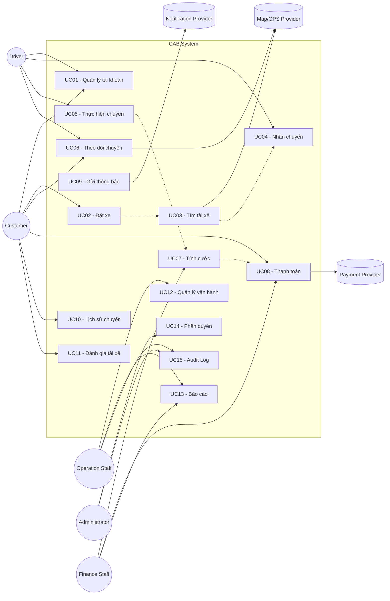

b1: xacs ddinh bussiness contact nguwx canh nghiepj vuj

business problem

mucj ddichs laf gif

gias trij cuaj ht nayf taoj ra so voiws ht cux

Xác định các stalkhoder?
Lập bảng 
c1: những stalkhoder 
c2 vai trò 
vẽ ma trận stakhoder () mức đọ ảnh  hưởng cảu các vai trò trong hệ thống
3.
bs goals :bg01: hỗ trợ thanh toán (= tiền mặt ....)
bg02: giảm time tìm tài xế(tìm tài tự động, gần nhất
4.
scope_Phạm vi
(ql đc khách hang, quản lý tài xế,...) 
không thuộc trong scope(Dung ai tìm dương ngắn nhất, xử lý nhu cầu kh,...) phải deal vs kh
5. Xác nhận lại với kh chuyển đổi thành business requirements
6. business process -quy trình nghiệp vụ dùng công cụ mermaid trong markdown
7. Functional Requirement 
- 
8. business rule và Exception
9. mô hình hóa dữ liệu, xác định các thực thể
10. yêu cầu phi chức năng
11. thiết kế các usecase
12. Đặt tả usecase
13. aceptant _ tiêu chí chấp nhận ac
14. truy xuất nguồn gốc yêu cầu _ requirement (rtm)
# 1. Business Context – Ngữ cảnh nghiệp vụ
   ABC là doanh nghiệp cung cấp dịch vụ đặt xe trực tuyến, trong đó có 3 nhóm người dùng chính:

      Customer – người có nhu cầu đặt xe.
      Driver – tài xế cung cấp dịch vụ vận chuyển.
      Operation Staff – nhân viên vận hành/quản trị hệ thống.
      
   Ngoài ra, hệ thống còn tương tác với các hệ thống bên ngoài:
      
      Payment Provider – nhà cung cấp thanh toán điện tử.
      Notification Provider – SMS/Email/Push Notification.
      Có thể có Map/Location Service để hỗ trợ vị trí, khoảng cách, ETA.
      Các hệ thống báo cáo/BI trong tương lai.

   Ngữ cảnh hiện tại: hệ thống cũ còn phụ thuộc nhiều vào tổng đài và thao tác thủ công, đặc biệt trong việc phân công tài xế, theo dõi chuyến và quản lý thanh toán.
   
                         
   # 1.2. Business Problem – Vấn đề kinh doanh
      Hệ thống đặt xe hiện tại phụ thuộc nhiều vào thao tác thủ công và chưa có khả năng quản lý tập trung toàn bộ vòng đời chuyến xe, dẫn đến hiệu quả điều phối thấp, trải nghiệm khách hàng hạn chế, khó kiểm soát thanh toán và dữ liệu vận hành, đồng thời làm giảm khả năng mở rộng dịch vụ của ABC.
      Hệ thống cũ có 6 vấn đề đang hiện hành:
        Phân công tài xế thủ công: Chậm xử lý booking, tăng chi phí vận hành
        Khó theo dõi trạng thái chuyến: Khách hàng thiếu thông tin, tăng cuộc gọi đến tổng đài
        Quản lý thanh toán chưa tập trung: Khó kiểm soát doanh thu và giao dịch
        Dữ liệu khách hàng/tài xế/chuyến đi phân tán: Khó quản lý và báo cáo
        Hệ thống khó mở rộng: Khó đáp ứng khi số lượng booking tăng
        Phụ thuộc vào một hệ thống/luồng xử lý: Một lỗi có thể ảnh hưởng toàn bộ dịch vụ

   # 1.3. Mục đích – Business Purpose
      Xây dựng một nền tảng CAB tập trung nhằm tự động hóa quy trình đặt và điều phối xe, nâng cao trải nghiệm khách hàng, tăng hiệu quả vận hành và tạo nền tảng công nghệ có khả năng mở rộng cho các dịch vụ vận tải trong tương lai.
   # 1.4. Giá trị của CAB System so với hệ thống cũ

| **Khía cạnh** | **Hệ thống cũ** | **CAB System mới** | **Giá trị tạo ra** |
|---|---|---|---|
| **Đặt xe** | Đặt qua tổng đài hoặc ứng dụng đơn giản | Đặt xe trực tiếp trên nền tảng | Số hóa và đơn giản hóa quy trình đặt xe |
| **Phân công tài xế** | Chủ yếu thực hiện thủ công | Tự động tìm và phân công tài xế phù hợp | Giảm thời gian và chi phí vận hành |
| **Tìm tài xế** | Khó xác định tài xế phù hợp/gần khách | Dựa trên vị trí, trạng thái và tiêu chí vận hành | Tăng hiệu quả điều phối |
| **Tài xế từ chối/không phản hồi** | Có thể phải xử lý thủ công lại | Tự động chuyển sang tài xế tiếp theo | Giảm thời gian chờ, hạn chế mất booking |
| **Theo dõi chuyến đi** | Khách hàng ít thông tin về trạng thái | Theo dõi trạng thái và ETA của chuyến | Tăng tính minh bạch và trải nghiệm khách hàng |
| **Vị trí tài xế** | Chưa được khai thác hiệu quả | Cập nhật và lưu thông tin vị trí | Hỗ trợ tìm tài xế và dự kiến thời gian đến |
| **Quản lý chuyến đi** | Thông tin phân tán, khó tra cứu | Quản lý tập trung toàn bộ vòng đời chuyến | Dễ kiểm soát và xử lý sự cố |
| **Tính cước** | Chưa được quản lý tập trung | Tự động tính cước theo loại dịch vụ và thông tin chuyến | Giảm sai sót, tăng tính nhất quán |
| **Thanh toán** | Chưa tập trung | Hỗ trợ tiền mặt và thanh toán điện tử | Quản lý giao dịch và doanh thu tốt hơn |
| **Xử lý thanh toán lỗi** | Khó kiểm soát và đối soát | Có trạng thái giao dịch và cơ chế xử lý lại | Giảm rủi ro thất thoát doanh thu |
| **Thông báo** | Hạn chế | Thông báo theo từng sự kiện của chuyến | Cải thiện trải nghiệm khách hàng và tài xế |
| **Dữ liệu** | Phân tán | Tập trung dữ liệu khách hàng, tài xế, xe, chuyến, thanh toán | Dễ tra cứu, đối soát và phân tích |
| **Quản lý vận hành** | Phụ thuộc nhiều vào thao tác thủ công | Có hệ thống quản trị riêng | Tăng năng suất nhân viên vận hành |
| **Báo cáo** | Khó tổng hợp | Dashboard và báo cáo về chuyến, doanh thu, hủy, hiệu quả tài xế | Hỗ trợ ra quyết định dựa trên dữ liệu |
| **Bảo mật** | Khả năng kiểm soát hạn chế | Authentication, Authorization và Audit Log | Tăng mức độ an toàn và khả năng kiểm tra |
| **Khả năng mở rộng** | Khó đáp ứng khi số lượng khách/tài xế tăng | Có khả năng scale các thành phần độc lập | Hỗ trợ tăng trưởng kinh doanh |
| **Khả năng tích hợp** | Khó tích hợp thêm dịch vụ | Có thể tích hợp Payment, Map, Notification Provider | Dễ mở rộng hệ sinh thái |
| **Khả năng thay đổi** | Thay đổi một chức năng có thể ảnh hưởng hệ thống | Kiến trúc modular, giảm coupling | Giảm chi phí và rủi ro phát triển tương lai |
| **Xử lý sự cố** | Một lỗi có thể ảnh hưởng nhiều chức năng | Có khả năng cô lập các thành phần như Payment/Notification | Tăng tính ổn định và khả năng phục hồi |
| **Phát triển sản phẩm mới** | Khó bổ sung dịch vụ mới | Có nền tảng để thêm loại xe/dịch vụ/phương thức thanh toán | Tạo nền tảng cho phát triển dài hạn |

## Tóm tắt giá trị

### Hệ thống cũ

> Đặt xe → Xử lý thủ công → Khó theo dõi → Dữ liệu phân tán → Khó mở rộng

### CAB System mới

> Đặt xe → Tự động tìm tài xế → Theo dõi chuyến → Tính cước → Thanh toán → Đánh giá → Báo cáo

### Giá trị kinh doanh kỳ vọng

- Giảm chi phí vận hành.
- Tăng năng lực phục vụ khách hàng.
- Nâng cao trải nghiệm khách hàng.
- Tăng hiệu quả điều phối tài xế.
- Tăng khả năng kiểm soát và phân tích dữ liệu.
- Tăng tính ổn định và khả năng mở rộng.
- Tạo nền tảng để phát triển thêm dịch vụ trong tương lai.
  
# 2. Stakeholders

| **C1: Stakeholder** | **C2: Vai trò** |
|---|---|
| **Ban giám đốc / Business Owner** | Định hướng kinh doanh, phê duyệt ngân sách, xác định mục tiêu và đánh giá hiệu quả dự án |
| **Khách hàng (Customer)** | Đăng ký, đặt xe, theo dõi chuyến, thanh toán, xem lịch sử và đánh giá tài xế |
| **Tài xế (Driver)** | Nhận/từ chối chuyến, cập nhật trạng thái chuyến, cập nhật vị trí và thông tin phương tiện |
| **Nhân viên vận hành (Operation Staff)** | Quản lý khách hàng, tài xế, phương tiện, theo dõi chuyến và xử lý các trường hợp bất thường |
| **Quản trị hệ thống (System Admin)** | Quản lý tài khoản, phân quyền, cấu hình và bảo mật hệ thống |
| **Bộ phận chăm sóc khách hàng (CS)** | Tiếp nhận và xử lý yêu cầu, khiếu nại, hỗ trợ khách hàng trong quá trình sử dụng dịch vụ |
| **Bộ phận tài chính / kế toán** | Theo dõi thanh toán, đối soát giao dịch, doanh thu và báo cáo tài chính |
| **Business Analyst (BA)** | Thu thập, phân tích, làm rõ và quản lý yêu cầu nghiệp vụ |
| **Project Manager (PM)** | Quản lý phạm vi, tiến độ, nguồn lực, rủi ro và phối hợp các bên |
| **Development Team** | Phân tích kỹ thuật, thiết kế và phát triển hệ thống CAB |
| **QA / Tester** | Kiểm thử chức năng, nghiệp vụ, hiệu năng và đảm bảo chất lượng hệ thống |
| **DevOps / Infrastructure** | Triển khai, vận hành, giám sát và đảm bảo khả năng mở rộng hệ thống |
| **Payment Provider** | Cung cấp dịch vụ thanh toán điện tử và xử lý giao dịch thanh toán |
| **Notification Provider** | Cung cấp dịch vụ gửi Push Notification, SMS, Email hoặc các kênh thông báo khác |
| **Map/GPS Provider** | Cung cấp dữ liệu bản đồ, vị trí, khoảng cách và hỗ trợ tính ETA |
| **Cơ quan quản lý / Pháp lý** | Đảm bảo hệ thống tuân thủ các quy định về vận tải, thanh toán và bảo vệ dữ liệu |

# 2.1. Ma trận Stakeholder – Mức độ ảnh hưởng

| **Stakeholder** | **Mức độ ảnh hưởng** | **Mức độ quan tâm** | **Chiến lược quản lý** |
|---|---|---|---|
| **Ban giám đốc / Business Owner** | 🔴 Cao | 🔴 Cao | **Manage Closely** – Tham gia quyết định, cập nhật thường xuyên |
| **Nhân viên vận hành (Operation)** | 🔴 Cao | 🔴 Cao | **Manage Closely** – Tham gia sâu vào phân tích nghiệp vụ |
| **Khách hàng (Customer)** | 🟠 Trung bình | 🔴 Cao | **Keep Informed** – Thu thập feedback và kiểm tra trải nghiệm |
| **Tài xế (Driver)** | 🟠 Trung bình | 🔴 Cao | **Keep Informed** – Thu thập nhu cầu và phản hồi |
| **System Admin** | 🔴 Cao | 🟠 Trung bình | **Keep Satisfied** – Đảm bảo quyền quản trị và bảo mật |
| **Bộ phận Tài chính / Kế toán** | 🟠 Trung bình | 🟠 Trung bình | **Keep Satisfied** – Đảm bảo yêu cầu thanh toán, đối soát |
| **Bộ phận CS** | 🟠 Trung bình | 🔴 Cao | **Keep Informed** – Đảm bảo chức năng hỗ trợ khách hàng |
| **Business Analyst (BA)** | 🔴 Cao | 🔴 Cao | **Manage Closely** – Phân tích và quản lý yêu cầu |
| **Project Manager (PM)** | 🔴 Cao | 🔴 Cao | **Manage Closely** – Quản lý tiến độ, phạm vi và rủi ro |
| **Development Team** | 🟠 Trung bình | 🔴 Cao | **Keep Informed / Collaborate** |
| **QA / Tester** | 🟢 Thấp – Trung bình | 🔴 Cao | **Keep Informed** – Đảm bảo chất lượng và nghiệp vụ |
| **DevOps / Infrastructure** | 🔴 Cao | 🟠 Trung bình – Cao | **Keep Satisfied / Collaborate** |
| **Payment Provider** | 🟠 Trung bình | 🟠 Trung bình | **Keep Satisfied** – Quản lý tích hợp và giao dịch |
| **Notification Provider** | 🟢 Thấp – Trung bình | 🟠 Trung bình | **Monitor / Keep Satisfied** |
| **Map/GPS Provider** | 🟠 Trung bình | 🟠 Trung bình | **Keep Satisfied** – Đảm bảo dữ liệu vị trí và ETA |
| **Cơ quan quản lý / Pháp lý** | 🔴 Cao | 🟠 Trung bình | **Keep Satisfied** – Đảm bảo tuân thủ pháp luật |

## Ma trận Power – Interest
  # 3. Ma trận Stakeholder – Power / Interest

| **Mức độ ảnh hưởng / Mức độ quan tâm** | **Thấp** | **Cao** |
|---|---|---|
| **Cao** | **KEEP SATISFIED** 🟠<br><br>• System Admin<br>• Tài chính / Kế toán<br>• DevOps / Infrastructure<br>• Payment Provider<br>• Map/GPS Provider<br>• Cơ quan quản lý / Pháp lý | **MANAGE CLOSELY** 🔴<br><br>• Ban giám đốc / Business Owner<br>• Nhân viên vận hành<br>• Business Analyst (BA)<br>• Project Manager (PM)<br>• Khách hàng<br>• Tài xế<br>• Development Team |
| **Thấp** | **MONITOR** 🟢<br><br>• Notification Provider | **KEEP INFORMED** 🟡<br><br>• Bộ phận CS<br>• QA / Tester |

## Sơ đồ ma trận

```text
                                             MỨC ĐỘ QUAN TÂM (INTEREST)
                    Thấp                         Cao
              ┌───────────────────────┬────────────────────────┐
              │                       │                        │
        Cao   │  KEEP SATISFIED       │  MANAGE CLOSELY        │
              │                       │                        │
              │ • System Admin        │ • Ban giám đốc         │
              │ • Tài chính/Kế toán   │ • Operation             │
              │ • DevOps              │ • BA                    │
              │ • Pháp lý             │ • PM                    │
              │ • Payment Provider    │ • Customer              │
              │ • Map/GPS             │ • Driver                │
              │                       │ • Development Team      │
              │                       │ • CS                    │
MỨC ĐỘ        │                       │                        │
ẢNH HƯỞNG     ├───────────────────────┼────────────────────────┤
(POWER)       │                       │                        │
              │  MONITOR              │  KEEP INFORMED         │
        Thấp  │                       │                        │
              │ • Notification        │ • QA/Tester             │
              │   Provider            │                        │
              │                       │                        │
              └───────────────────────┴────────────────────────┘

```
# 3. Business Goals

| **ID** | **Business Goal** | **Mô tả** | **Giá trị kinh doanh** |
|---|---|---|---|
| **BG-01** | **Tự động hóa quy trình đặt xe và điều phối** | Tự động hóa từ lúc khách hàng tạo yêu cầu đến khi tìm và phân công tài xế | Giảm thao tác thủ công, giảm chi phí vận hành |
| **BG-02** | **Nâng cao trải nghiệm khách hàng** | Cho phép khách hàng đặt xe, theo dõi trạng thái, tài xế và ETA | Tăng sự hài lòng và khả năng giữ chân khách hàng |
| **BG-03** | **Tăng hiệu quả sử dụng tài xế** | Tìm tài xế phù hợp dựa trên vị trí, trạng thái và tiêu chí vận hành | Tăng tỷ lệ nhận chuyến và giảm thời gian chờ |
| **BG-04** | **Tăng năng lực phục vụ** | Hệ thống có khả năng xử lý số lượng lớn khách hàng, tài xế và chuyến đi | Hỗ trợ mở rộng quy mô kinh doanh |
| **BG-05** | **Tập trung hóa dữ liệu** | Quản lý tập trung dữ liệu khách hàng, tài xế, phương tiện, chuyến đi và giao dịch | Dễ tra cứu, kiểm soát và đối soát |
| **BG-06** | **Nâng cao hiệu quả quản lý doanh thu** | Tự động tính cước, hỗ trợ nhiều phương thức thanh toán và quản lý giao dịch | Giảm sai sót và tăng khả năng kiểm soát doanh thu |
| **BG-07** | **Quản trị dựa trên dữ liệu** | Cung cấp báo cáo về số chuyến, doanh thu, tỷ lệ hoàn thành, hủy và hiệu quả tài xế | Hỗ trợ ra quyết định chính xác |
| **BG-08** | **Đảm bảo tính ổn định và khả năng phục hồi** | Cô lập lỗi của các thành phần như Payment hoặc Notification | Giảm downtime và rủi ro vận hành |
| **BG-09** | **Đảm bảo bảo mật dữ liệu** | Bảo vệ thông tin cá nhân, vị trí, phương tiện và dữ liệu giao dịch | Giảm rủi ro bảo mật và hỗ trợ tuân thủ |
| **BG-10** | **Xây dựng nền tảng có khả năng mở rộng** | Cho phép bổ sung dịch vụ, phương thức thanh toán và nhà cung cấp mới | Giảm chi phí phát triển trong tương lai |
| **BG-11** | **Tăng khả năng kiểm soát hoạt động** | Cung cấp audit log và công cụ quản lý, theo dõi các chuyến bất thường | Tăng khả năng kiểm tra và xử lý sự cố |
| **BG-12** | **Tạo nền tảng phát triển dịch vụ mới** | Kiến trúc linh hoạt để bổ sung các loại hình dịch vụ vận tải mới | Tạo cơ hội tăng trưởng dài hạn |

# 4. Scope – Phạm vi dự án

## 4.1. In Scope – Phạm vi thuộc dự án

| **STT** | **Phạm vi** | **Mô tả** |
|---|---|---|
| **1** | **Quản lý khách hàng** | Đăng ký, đăng nhập, cập nhật thông tin cá nhân, quản lý tài khoản khách hàng |
| **2** | **Quản lý tài xế** | Đăng ký/tạo tài khoản, cập nhật hồ sơ, trạng thái hoạt động và thông tin tài xế |
| **3** | **Quản lý phương tiện** | Quản lý thông tin xe, loại xe và trạng thái phương tiện |
| **4** | **Đặt xe** | Khách hàng nhập điểm đón, điểm đến, lựa chọn loại xe và tạo yêu cầu đặt xe |
| **5** | **Tìm và phân công tài xế** | Xác định tài xế phù hợp dựa trên vị trí, trạng thái sẵn sàng và các tiêu chí vận hành đã được thống nhất |
| **6** | **Quản lý trạng thái chuyến đi** | Theo dõi các trạng thái: đang tìm tài xế, đã nhận chuyến, tài xế đã đến, đã đón khách, đang di chuyển, hoàn thành, hủy |
| **7** | **Theo dõi vị trí tài xế** | Tiếp nhận và lưu thông tin vị trí tài xế để hỗ trợ điều phối và hiển thị ETA |
| **8** | **Thông báo** | Gửi thông báo cho khách hàng/tài xế về các sự kiện quan trọng của chuyến đi |
| **9** | **Tính cước** | Xác định số tiền khách hàng phải trả dựa trên loại dịch vụ và thông tin chuyến đi |
| **10** | **Thanh toán** | Hỗ trợ tiền mặt và tích hợp thanh toán điện tử thông qua Payment Provider |
| **11** | **Xử lý giao dịch thanh toán** | Theo dõi trạng thái giao dịch, thông báo kết quả và xử lý thanh toán lại theo chính sách được thống nhất |
| **12** | **Lịch sử chuyến đi** | Cho phép khách hàng tra cứu các chuyến đã thực hiện và thông tin thanh toán |
| **13** | **Đánh giá tài xế** | Cho phép khách hàng đánh giá tài xế sau khi chuyến hoàn thành |
| **14** | **Quản lý vận hành** | Nhân viên vận hành theo dõi khách hàng, tài xế, phương tiện và các chuyến đang diễn ra |
| **15** | **Xử lý sự cố chuyến đi** | Cho phép nhân viên vận hành kiểm tra và hỗ trợ xử lý các trường hợp chuyến bị lỗi |
| **16** | **Phân quyền quản trị** | Kiểm soát quyền truy cập và các thao tác quản trị theo vai trò |
| **17** | **Báo cáo** | Báo cáo số lượng chuyến, doanh thu, tỷ lệ hoàn thành, tỷ lệ hủy và hiệu quả tài xế |
| **18** | **Audit Log** | Lưu vết các thao tác quan trọng để phục vụ kiểm tra và xử lý sự cố |
| **19** | **Tích hợp hệ thống bên ngoài** | Tích hợp Payment Provider, Notification Provider và Map/GPS Provider |
| **20** | **Bảo mật** | Xác thực người dùng, phân quyền và bảo vệ dữ liệu cá nhân, vị trí và giao dịch |

---

## 4.2. Out of Scope – Không thuộc phạm vi dự án

| **STT** | **Nội dung** | **Lý do / Ghi chú** |
|---|---|---|
| **1** | **Tự động xác định tuyến đường ngắn nhất** | CAB sử dụng dịch vụ Map/GPS bên ngoài để cung cấp routing; thuật toán tìm đường không thuộc phạm vi xây dựng |
| **2** | **Tự phát triển hệ thống bản đồ/GPS** | Sử dụng Map/GPS Provider thay vì xây dựng hệ thống bản đồ riêng |
| **3** | **Tự xây dựng cổng thanh toán** | CAB chỉ tích hợp Payment Provider; thông tin thẻ/tài khoản nhạy cảm không được lưu trực tiếp |
| **4** | **Tự xây dựng hệ thống gửi SMS/Email/Push** | Sử dụng Notification Provider bên ngoài |
| **5** | **Quản lý nhu cầu khách hàng ngoài phạm vi đặt xe** | Ví dụ: xử lý các yêu cầu chăm sóc khách hàng, khiếu nại hoặc yêu cầu đặc biệt cần được xác định riêng |
| **6** | **Thuật toán tối ưu phân công tài xế nâng cao** | Chiến lược ưu tiên tài xế, scoring và thuật toán tối ưu cần được khách hàng xác nhận trước khi triển khai |
| **7** | **Tự xác định chính sách giá/cước kinh doanh** | Hệ thống thực thi công thức đã được doanh nghiệp thống nhất; việc xây dựng chính sách giá thuộc Business Owner |
| **8** | **Tự xác định chính sách hủy chuyến** | Quy tắc phí hủy, thời gian hủy và các trường hợp miễn phí cần được khách hàng xác nhận |
| **9** | **Tự xác định thời gian phản hồi của tài xế** | Timeout bao lâu trước khi chuyển sang tài xế khác cần được Business Owner xác định |
| **10** | **Tự quyết định tiêu chí tài xế phù hợp** | Các tiêu chí như khoảng cách, loại xe, rating, trạng thái... cần được thống nhất với khách hàng |
| **11** | **Quản lý nhân sự tài xế ngoài hệ thống CAB** | Tuyển dụng, đào tạo, lương thưởng và quản lý nhân sự không thuộc phạm vi nền tảng |
| **12** | **Hoạt động marketing/khuyến mãi** | Chương trình marketing và chiến lược kinh doanh chưa được xác định trong phạm vi hiện tại |

---

## 4.3. Các nội dung cần xác nhận với khách hàng

Các nội dung sau **chưa nên tự đưa ra quyết định trong phạm vi dự án** mà cần BA làm rõ với Business Owner/Operation:

| **STT** | **Vấn đề cần xác nhận** | **Câu hỏi cần làm rõ** |
|---|---|---|
| **1** | **Tính cước** | Công thức tính giá là gì? Theo km, thời gian, loại xe hay kết hợp? |
| **2** | **Ưu tiên tài xế** | Ưu tiên theo khoảng cách, rating, thời gian online hay tiêu chí nào khác? |
| **3** | **Thời gian phản hồi** | Tài xế có bao nhiêu giây/phút để accept hoặc reject? |
| **4** | **Không tìm được tài xế** | Sau bao nhiêu lần tìm kiếm thì booking được đánh dấu thất bại? |
| **5** | **Hủy chuyến** | Ai được hủy? Khi nào được hủy? Có tính phí không? |
| **6** | **Mất kết nối** | Xử lý thế nào khi khách hàng hoặc tài xế mất mạng trong quá trình chuyến đi? |
| **7** | **Thanh toán thất bại** | Cho phép retry bao nhiêu lần? Khi nào chuyển sang xử lý thủ công? |
| **8** | **Lưu trữ dữ liệu** | Dữ liệu khách hàng, vị trí, giao dịch và audit log được lưu trong bao lâu? |
| **9** | **ETA** | ETA lấy hoàn toàn từ Map/GPS Provider hay có logic điều chỉnh của ABC? |
| **10** | **Tiêu chí tài xế phù hợp** | Loại xe, khoảng cách, trạng thái, rating và các điều kiện khác có được áp dụng không? |
| **11** | **Kênh thông báo** | Giai đoạn đầu cần Push, SMS, Email hay tất cả? |
| **12** | **Loại dịch vụ** | MVP chỉ hỗ trợ một loại dịch vụ hay nhiều loại xe/dịch vụ? |

---

## 4.4. Scope Boundary

```text
                    CAB SYSTEM
                         │
        ┌────────────────┴────────────────┐
        │                                 │
     IN SCOPE                         OUT OF SCOPE
        │                                 │
        ├─ Quản lý khách hàng             ├─ Xây dựng Map/GPS
        ├─ Quản lý tài xế                 ├─ Tìm đường ngắn nhất
        ├─ Quản lý phương tiện           ├─ Xây dựng Payment Gateway
        ├─ Đặt xe                         ├─ Xây dựng Notification Provider
        ├─ Tìm & phân tài xế              ├─ Chính sách giá
        ├─ Theo dõi chuyến                ├─ Chính sách hủy
        ├─ Tính cước                      ├─ Tuyển dụng tài xế
        ├─ Thanh toán                     ├─ Marketing
        ├─ Thông báo                      └─ Các yêu cầu chưa được
        ├─ Đánh giá                          Business Owner xác nhận
        ├─ Quản lý vận hành
        ├─ Báo cáo
        ├─ Phân quyền
        └─ Audit Log
```
# 5. Business Requirements – Yêu cầu nghiệp vụ

| **ID** | **Business Requirement** | **Mô tả** | **Stakeholder xác nhận** | **Ưu tiên** |
|---|---|---|---|---|
| **BR-01** | Quản lý khách hàng | Hệ thống phải cho phép khách hàng đăng ký, đăng nhập và cập nhật thông tin cá nhân | Business Owner / Operation | Must Have |
| **BR-02** | Quản lý tài xế | Hệ thống phải cho phép tạo và quản lý tài khoản, hồ sơ, trạng thái hoạt động của tài xế | Business Owner / Operation | Must Have |
| **BR-03** | Quản lý phương tiện | Hệ thống phải quản lý thông tin phương tiện và loại xe của tài xế | Operation | Must Have |
| **BR-04** | Đặt xe | Khách hàng phải có thể nhập điểm đón, điểm đến, chọn loại xe và tạo yêu cầu đặt xe | Customer / Business Owner | Must Have |
| **BR-05** | Tìm tài xế | Hệ thống phải tự động tìm tài xế phù hợp dựa trên các tiêu chí nghiệp vụ đã được thống nhất | Business Owner / Operation | Must Have |
| **BR-06** | Phân công tài xế | Hệ thống phải gửi yêu cầu đến tài xế phù hợp và tiếp tục tìm tài xế khác nếu tài xế từ chối hoặc không phản hồi | Operation / Business Owner | Must Have |
| **BR-07** | Tiêu chí ưu tiên tài xế | Doanh nghiệp phải xác định các tiêu chí dùng để ưu tiên tài xế như khoảng cách, trạng thái, loại xe hoặc các tiêu chí khác | Business Owner / Operation | Must Have |
| **BR-08** | Thời gian phản hồi tài xế | Doanh nghiệp phải xác định thời gian tài xế được phép phản hồi trước khi hệ thống chuyển sang tài xế khác | Business Owner / Operation | Must Have |
| **BR-09** | Theo dõi chuyến đi | Khách hàng phải có thể theo dõi trạng thái chuyến từ lúc tạo yêu cầu đến khi hoàn thành | Customer / Operation | Must Have |
| **BR-10** | Theo dõi vị trí tài xế | Hệ thống phải tiếp nhận vị trí tài xế để hỗ trợ tìm tài xế và dự kiến thời gian đến | Operation / Driver | Must Have |
| **BR-11** | Thông báo | Hệ thống phải thông báo cho khách hàng và tài xế khi xảy ra các sự kiện quan trọng của chuyến | Customer / Driver / Operation | Must Have |
| **BR-12** | Tính cước | Hệ thống phải tính số tiền khách hàng cần thanh toán theo chính sách giá đã được doanh nghiệp xác nhận | Business Owner / Finance | Must Have |
| **BR-13** | Chính sách giá | Doanh nghiệp phải xác định công thức tính cước dựa trên loại dịch vụ, khoảng cách, thời gian và các yếu tố liên quan | Business Owner / Finance | Must Have |
| **BR-14** | Thanh toán | Hệ thống phải hỗ trợ thanh toán tiền mặt và thanh toán điện tử thông qua Payment Provider | Customer / Finance | Must Have |
| **BR-15** | Xử lý thanh toán thất bại | Khi thanh toán điện tử thất bại, hệ thống phải thông báo và cho phép xử lý lại theo chính sách doanh nghiệp | Customer / Finance | Must Have |
| **BR-16** | Hủy chuyến | Hệ thống phải hỗ trợ hủy chuyến theo chính sách hủy đã được doanh nghiệp xác nhận | Business Owner / Operation | Must Have |
| **BR-17** | Xử lý mất kết nối | Hệ thống phải có cơ chế xử lý khi khách hàng hoặc tài xế mất kết nối trong quá trình đặt và thực hiện chuyến | Operation / Business Owner | Should Have |
| **BR-18** | Không tìm được tài xế | Nếu không tìm được tài xế phù hợp, hệ thống phải thông báo rõ ràng cho khách hàng | Customer / Operation | Must Have |
| **BR-19** | Lịch sử chuyến | Khách hàng phải có thể xem lịch sử chuyến, trạng thái và số tiền đã thanh toán | Customer | Must Have |
| **BR-20** | Đánh giá tài xế | Khách hàng phải có thể đánh giá tài xế sau khi chuyến hoàn thành | Customer / Business Owner | Should Have |
| **BR-21** | Quản lý vận hành | Nhân viên vận hành phải có thể xem và quản lý khách hàng, tài xế, phương tiện và các chuyến đang diễn ra | Operation | Must Have |
| **BR-22** | Xử lý sự cố | Nhân viên vận hành phải có thể tra cứu và hỗ trợ xử lý các chuyến bị lỗi hoặc bất thường | Operation / CS | Must Have |
| **BR-23** | Phân quyền | Hệ thống phải kiểm soát quyền truy cập theo vai trò và không cho phép nhân viên thực hiện các thao tác ngoài quyền hạn | Business Owner / System Admin | Must Have |
| **BR-24** | Báo cáo | Hệ thống phải cung cấp báo cáo về số chuyến, doanh thu, tỷ lệ hoàn thành, tỷ lệ hủy và hiệu quả tài xế | Business Owner / Finance / Operation | Should Have |
| **BR-25** | Audit Log | Hệ thống phải lưu vết các thao tác quan trọng của người dùng và nhân viên quản trị | Business Owner / System Admin | Must Have |
| **BR-26** | Bảo vệ dữ liệu | Hệ thống phải bảo vệ thông tin cá nhân, dữ liệu vị trí và dữ liệu giao dịch | Business Owner / System Admin | Must Have |
| **BR-27** | Không lưu dữ liệu thanh toán nhạy cảm | CAB không được lưu trực tiếp thông tin thẻ hoặc thông tin thanh toán nhạy cảm của khách hàng | Business Owner / Finance | Must Have |
| **BR-28** | Khả năng mở rộng | Hệ thống phải cho phép mở rộng số lượng khách hàng, tài xế và chuyến mà không ảnh hưởng nghiêm trọng đến các chức năng hiện tại | Business Owner / Technical Team | Must Have |
| **BR-29** | Mở rộng phương thức thanh toán | Hệ thống phải được thiết kế để có thể tích hợp thêm Payment Provider hoặc phương thức thanh toán mới | Business Owner / Finance | Should Have |
| **BR-30** | Mở rộng kênh thông báo | Hệ thống phải cho phép bổ sung Notification Provider hoặc kênh thông báo mới mà không phải thay đổi toàn bộ hệ thống | Business Owner / Operation | Should Have |
| **BR-31** | Mở rộng dịch vụ | Hệ thống phải có khả năng bổ sung các loại hình dịch vụ hoặc loại xe mới trong tương lai | Business Owner | Should Have |
| **BR-32** | Báo cáo và dữ liệu quản trị | Hệ thống phải cung cấp dữ liệu đầy đủ để Ban giám đốc đánh giá hiệu quả hoạt động và ra quyết định | Business Owner | Should Have |

# 6. Business Process – Quy trình nghiệp vụ

## 6.1. Quy trình đặt xe tổng thể


##6.2. Quy trình tìm và phân công tài xế
flowchart TD
    A([Nhận yêu cầu đặt xe]) --> B[Xác định tiêu chí tìm tài xế]

    B --> C[Lọc tài xế]
    C --> D[Kiểm tra trạng thái sẵn sàng]
    D --> E[Kiểm tra loại xe]
    E --> F[Kiểm tra vị trí]
    F --> G[Áp dụng tiêu chí ưu tiên]

    G --> H{Có tài xế phù hợp?}

    H -- Không --> I[Thông báo không tìm được tài xế]
    I --> J([Kết thúc])

    H -- Có --> K[Chọn tài xế ưu tiên]
    K --> L[Gửi thông báo yêu cầu chuyến]

    L --> M{Tài xế phản hồi trong thời gian quy định?}

    M -- Không --> N[Đánh dấu timeout]
    N --> C

    M -- Có --> O{Chấp nhận chuyến?}

    O -- Không --> P[Ghi nhận từ chối]
    P --> C

    O -- Có --> Q[Xác nhận phân công tài xế]
    Q --> R[Cập nhật trạng thái chuyến]
    R --> S[Thông báo cho khách hàng]
    S --> T([Kết thúc])


6.3. Quy trình thực hiện chuyến
flowchart TD
    A([Tài xế nhận chuyến]) --> B[Đi đến điểm đón]

    B --> C[Cập nhật vị trí tài xế]
    C --> D[Cập nhật ETA]

    D --> E{Đã đến điểm đón?}

    E -- Chưa --> C
    E -- Có --> F[Cập nhật trạng thái Đã đến]

    F --> G[Thông báo khách hàng]
    G --> H[Đón khách]

    H --> I[Cập nhật trạng thái Đã đón khách]
    I --> J[Bắt đầu chuyến]

    J --> K[Cập nhật trạng thái Đang di chuyển]
    K --> L[Theo dõi vị trí]

    L --> M{Đã đến điểm đến?}

    M -- Chưa --> L
    M -- Có --> N[Hoàn thành chuyến]

    N --> O[Cập nhật trạng thái Hoàn thành]
    O --> P[Chuyển sang quy trình tính cước]
    P --> Q([Kết thúc])
6.4. Quy trình thanh toán
flowchart TD
    A([Chuyến đi hoàn thành]) --> B[Tính cước]
    B --> C[Hiển thị số tiền phải trả]

    C --> D{Phương thức thanh toán}

    D -- Tiền mặt --> E[Khách hàng thanh toán cho tài xế]
    E --> F[Ghi nhận thanh toán tiền mặt]

    D -- Điện tử --> G[Gửi giao dịch đến Payment Provider]

    G --> H{Thanh toán thành công?}

    H -- Có --> I[Ghi nhận giao dịch thành công]
    I --> J[Thông báo thanh toán thành công]

    H -- Không --> K[Ghi nhận giao dịch thất bại]
    K --> L[Thông báo khách hàng]
    L --> M{Cho phép thanh toán lại?}

    M -- Có --> G
    M -- Không --> N[Xử lý theo chính sách doanh nghiệp]

    F --> O[Lưu giao dịch]
    J --> O
    N --> O

    O --> P([Kết thúc])
6.5. Quy trình vận hành và xử lý sự cố
flowchart TD
    A([Nhân viên vận hành đăng nhập]) --> B[Xem Dashboard]
    B --> C[Theo dõi chuyến đang diễn ra]

    C --> D{Có chuyến bất thường?}

    D -- Không --> C

    D -- Có --> E[Kiểm tra thông tin chuyến]
    E --> F[Kiểm tra khách hàng]
    E --> G[Kiểm tra tài xế]
    E --> H[Kiểm tra trạng thái thanh toán]

    F --> I[Xác định nguyên nhân]
    G --> I
    H --> I

    I --> J{Có thể xử lý tự động?}

    J -- Có --> K[Hệ thống xử lý]
    K --> L[Cập nhật trạng thái]

    J -- Không --> M[Nhân viên vận hành xử lý]
    M --> L

    L --> N[Ghi nhận Audit Log]
    N --> O[Thông báo các bên liên quan]
    O --> C
##6.6. Tổng quan Business Process
flowchart LR
    A[Customer] --> B[Đặt xe]
    B --> C[Ride Management]

    C --> D[Driver Matching]
    D --> E[Driver]

    E --> F[Thực hiện chuyến]
    F --> G[Hoàn thành chuyến]

    G --> H[Fare Calculation]
    H --> I[Payment]

    I --> J[Notification]
    J --> A

    G --> K[Rating]
    K --> A

    C --> L[Operation]
    L --> C

    I --> M[Finance]
    M --> L

# 7. Functional Requirements – Yêu cầu chức năng

## 7.1. Quản lý tài khoản và người dùng

| **ID** | **Functional Requirement** | **Mô tả** | **Priority** |
|---|---|---|---|
| **FR-01** | Đăng ký tài khoản khách hàng | Hệ thống cho phép khách hàng tạo tài khoản bằng thông tin được yêu cầu | Must Have |
| **FR-02** | Đăng nhập | Khách hàng và tài xế có thể đăng nhập để sử dụng các chức năng yêu cầu xác thực | Must Have |
| **FR-03** | Đăng xuất | Người dùng có thể đăng xuất khỏi hệ thống | Must Have |
| **FR-04** | Cập nhật thông tin cá nhân | Khách hàng và tài xế có thể xem và cập nhật thông tin cá nhân | Must Have |
| **FR-05** | Quản lý tài khoản tài xế | Nhân viên vận hành có thể tạo, cập nhật, khóa/mở khóa tài khoản tài xế | Must Have |
| **FR-06** | Phân quyền người dùng | Hệ thống xác định quyền dựa trên vai trò của người dùng | Must Have |

---

## 7.2. Quản lý tài xế và phương tiện

| **ID** | **Functional Requirement** | **Mô tả** | **Priority** |
|---|---|---|---|
| **FR-07** | Cập nhật hồ sơ tài xế | Tài xế có thể cập nhật thông tin hồ sơ theo quyền được cấp | Must Have |
| **FR-08** | Quản lý phương tiện | Tài xế/Operation có thể thêm, cập nhật thông tin phương tiện | Must Have |
| **FR-09** | Cập nhật trạng thái tài xế | Tài xế có thể chuyển trạng thái Available/Unavailable | Must Have |
| **FR-10** | Cập nhật vị trí tài xế | Hệ thống tiếp nhận và cập nhật vị trí hiện tại của tài xế | Must Have |
| **FR-11** | Xem trạng thái tài xế | Operation có thể xem trạng thái hoạt động của tài xế | Must Have |
| **FR-12** | Xem thông tin tài xế | Khách hàng có thể xem thông tin cơ bản của tài xế sau khi tài xế nhận chuyến | Must Have |

---

## 7.3. Đặt xe

| **ID** | **Functional Requirement** | **Mô tả** | **Priority** |
|---|---|---|---|
| **FR-13** | Nhập điểm đón | Khách hàng có thể nhập/chọn điểm đón | Must Have |
| **FR-14** | Nhập điểm đến | Khách hàng có thể nhập/chọn điểm đến | Must Have |
| **FR-15** | Chọn loại xe | Khách hàng có thể lựa chọn loại xe/dịch vụ | Must Have |
| **FR-16** | Tạo yêu cầu đặt xe | Hệ thống tạo booking khi khách hàng xác nhận đặt xe | Must Have |
| **FR-17** | Xác nhận yêu cầu | Hệ thống xác nhận việc tiếp nhận yêu cầu đặt xe | Must Have |
| **FR-18** | Hủy yêu cầu | Khách hàng có thể hủy yêu cầu theo chính sách hủy | Must Have |
| **FR-19** | Kiểm tra trạng thái booking | Khách hàng có thể xem trạng thái hiện tại của booking | Must Have |

---

## 7.4. Tìm và phân công tài xế

| **ID** | **Functional Requirement** | **Mô tả** | **Priority** |
|---|---|---|---|
| **FR-20** | Tìm tài xế phù hợp | Hệ thống tìm tài xế dựa trên các tiêu chí nghiệp vụ đã cấu hình | Must Have |
| **FR-21** | Lọc tài xế | Hệ thống lọc tài xế theo trạng thái, loại xe và các điều kiện phù hợp | Must Have |
| **FR-22** | Ưu tiên tài xế | Hệ thống sắp xếp/ưu tiên tài xế theo business rule đã xác nhận | Must Have |
| **FR-23** | Gửi yêu cầu đến tài xế | Hệ thống gửi thông báo yêu cầu chuyến đến tài xế được chọn | Must Have |
| **FR-24** | Tài xế nhận chuyến | Tài xế có thể chấp nhận yêu cầu chuyến | Must Have |
| **FR-25** | Tài xế từ chối chuyến | Tài xế có thể từ chối yêu cầu chuyến | Must Have |
| **FR-26** | Xử lý timeout | Nếu tài xế không phản hồi trong thời gian quy định, hệ thống chuyển sang tài xế khác | Must Have |
| **FR-27** | Tìm tài xế tiếp theo | Nếu tài xế từ chối/timeout, hệ thống tiếp tục tìm tài xế khác | Must Have |
| **FR-28** | Thông báo không tìm được tài xế | Hệ thống thông báo khách hàng khi không còn tài xế phù hợp | Must Have |

---

## 7.5. Quản lý và theo dõi chuyến đi

| **ID** | **Functional Requirement** | **Mô tả** | **Priority** |
|---|---|---|---|
| **FR-29** | Cập nhật trạng thái chuyến | Tài xế có thể cập nhật trạng thái chuyến theo từng giai đoạn | Must Have |
| **FR-30** | Trạng thái tài xế đã đến | Tài xế cập nhật khi đến điểm đón | Must Have |
| **FR-31** | Trạng thái đã đón khách | Tài xế cập nhật khi đã đón khách | Must Have |
| **FR-32** | Trạng thái đang di chuyển | Tài xế cập nhật khi bắt đầu di chuyển đến điểm đến | Must Have |
| **FR-33** | Hoàn thành chuyến | Tài xế xác nhận hoàn thành chuyến | Must Have |
| **FR-34** | Theo dõi vị trí | Hệ thống cập nhật vị trí tài xế trong quá trình thực hiện chuyến | Must Have |
| **FR-35** | Hiển thị ETA | Hệ thống hiển thị thời gian dự kiến tài xế đến | Should Have |
| **FR-36** | Khách hàng theo dõi chuyến | Khách hàng có thể xem trạng thái và thông tin chuyến hiện tại | Must Have |
| **FR-37** | Operation theo dõi chuyến | Nhân viên vận hành có thể xem các chuyến đang diễn ra | Must Have |

---

## 7.6. Tính cước

| **ID** | **Functional Requirement** | **Mô tả** | **Priority** |
|---|---|---|---|
| **FR-38** | Tính cước chuyến đi | Hệ thống tính số tiền phải trả sau khi chuyến hoàn thành | Must Have |
| **FR-39** | Xác định loại giá | Hệ thống áp dụng mức giá tương ứng với loại dịch vụ/loại xe | Must Have |
| **FR-40** | Hiển thị số tiền | Hệ thống hiển thị số tiền khách hàng cần thanh toán | Must Have |
| **FR-41** | Lưu thông tin cước | Hệ thống lưu thông tin giá trị giao dịch của chuyến | Must Have |

> **TBD:** Công thức tính cước cụ thể cần được Business Owner xác nhận.

---

## 7.7. Thanh toán

| **ID** | **Functional Requirement** | **Mô tả** | **Priority** |
|---|---|---|---|
| **FR-42** | Thanh toán tiền mặt | Hệ thống ghi nhận trạng thái thanh toán tiền mặt | Must Have |
| **FR-43** | Thanh toán điện tử | Hệ thống gửi yêu cầu thanh toán đến Payment Provider | Must Have |
| **FR-44** | Nhận kết quả thanh toán | Hệ thống tiếp nhận kết quả giao dịch từ Payment Provider | Must Have |
| **FR-45** | Ghi nhận giao dịch | Hệ thống lưu trạng thái và thông tin cần thiết của giao dịch | Must Have |
| **FR-46** | Xử lý thanh toán thất bại | Hệ thống thông báo khi giao dịch thất bại | Must Have |
| **FR-47** | Thanh toán lại | Hệ thống cho phép thực hiện lại giao dịch theo chính sách doanh nghiệp | Should Have |
| **FR-48** | Không lưu dữ liệu nhạy cảm | Hệ thống không lưu trực tiếp thông tin thẻ/tài khoản thanh toán nhạy cảm | Must Have |

---

## 7.8. Thông báo

| **ID** | **Functional Requirement** | **Mô tả** | **Priority** |
|---|---|---|---|
| **FR-49** | Thông báo tiếp nhận booking | Thông báo cho khách hàng khi yêu cầu đặt xe được tiếp nhận | Must Have |
| **FR-50** | Thông báo tài xế nhận chuyến | Thông báo cho khách hàng khi tài xế đã nhận chuyến | Must Have |
| **FR-51** | Thông báo tài xế đến | Thông báo khi tài xế đến điểm đón | Must Have |
| **FR-52** | Thông báo hoàn thành chuyến | Thông báo khi chuyến hoàn thành | Must Have |
| **FR-53** | Thông báo thanh toán | Thông báo kết quả thanh toán cho khách hàng | Must Have |
| **FR-54** | Thông báo chuyến mới cho tài xế | Thông báo cho tài xế khi có yêu cầu chuyến phù hợp | Must Have |
| **FR-55** | Thông báo thay đổi chuyến | Thông báo cho các bên khi trạng thái chuyến thay đổi | Should Have |
| **FR-56** | Quản lý kênh thông báo | Hệ thống hỗ trợ tích hợp nhiều Notification Provider | Should Have |

---

## 7.9. Lịch sử và đánh giá

| **ID** | **Functional Requirement** | **Mô tả** | **Priority** |
|---|---|---|---|
| **FR-57** | Xem lịch sử chuyến | Khách hàng có thể xem danh sách các chuyến đã thực hiện | Must Have |
| **FR-58** | Xem chi tiết chuyến | Khách hàng có thể xem thông tin chi tiết của từng chuyến | Must Have |
| **FR-59** | Xem lịch sử thanh toán | Khách hàng có thể xem thông tin thanh toán của chuyến | Should Have |
| **FR-60** | Đánh giá tài xế | Khách hàng có thể đánh giá tài xế sau khi hoàn thành chuyến | Should Have |
| **FR-61** | Xem đánh giá | Operation có thể xem thông tin đánh giá tài xế | Should Have |

---

## 7.10. Quản lý vận hành

| **ID** | **Functional Requirement** | **Mô tả** | **Priority** |
|---|---|---|---|
| **FR-62** | Dashboard vận hành | Hiển thị tổng quan tình trạng chuyến và tài xế | Must Have |
| **FR-63** | Quản lý khách hàng | Operation có thể tra cứu và cập nhật thông tin khách hàng theo quyền | Must Have |
| **FR-64** | Quản lý tài xế | Operation có thể quản lý hồ sơ và trạng thái tài xế | Must Have |
| **FR-65** | Quản lý phương tiện | Operation có thể quản lý thông tin phương tiện | Must Have |
| **FR-66** | Theo dõi chuyến đang diễn ra | Operation có thể xem các chuyến đang thực hiện | Must Have |
| **FR-67** | Tra cứu chuyến | Operation có thể tìm kiếm và xem lịch sử chuyến | Must Have |
| **FR-68** | Xử lý chuyến lỗi | Operation có thể hỗ trợ xử lý các chuyến bị lỗi/bất thường | Must Have |
| **FR-69** | Tra cứu giao dịch | Operation/Finance có thể tra cứu thông tin giao dịch | Must Have |

---

## 7.11. Báo cáo

| **ID** | **Functional Requirement** | **Mô tả** | **Priority** |
|---|---|---|---|
| **FR-70** | Báo cáo số lượng chuyến | Thống kê số lượng chuyến theo khoảng thời gian | Should Have |
| **FR-71** | Báo cáo doanh thu | Thống kê doanh thu theo thời gian và loại dịch vụ | Should Have |
| **FR-72** | Báo cáo tỷ lệ hoàn thành | Thống kê tỷ lệ chuyến hoàn thành | Should Have |
| **FR-73** | Báo cáo tỷ lệ hủy | Thống kê tỷ lệ chuyến bị hủy | Should Have |
| **FR-74** | Báo cáo hiệu quả tài xế | Thống kê các chỉ số hoạt động của tài xế | Should Have |

---

## 7.12. Phân quyền và Audit Log

| **ID** | **Functional Requirement** | **Mô tả** | **Priority** |
|---|---|---|---|
| **FR-75** | Quản lý Role | System Admin có thể quản lý vai trò người dùng | Must Have |
| **FR-76** | Kiểm soát quyền truy cập | Hệ thống kiểm tra quyền trước khi cho phép thực hiện thao tác | Must Have |
| **FR-77** | Audit Log | Hệ thống ghi nhận các thao tác quản trị và thao tác quan trọng | Must Have |
| **FR-78** | Tra cứu Audit Log | Người có quyền có thể tìm kiếm và xem lịch sử thao tác | Must Have |

# 8. Business Rules & Exceptions

## 8.1. Business Rules – Quy tắc nghiệp vụ

| **ID** | **Business Rule** | **Mô tả** | **Trạng thái** |
|---|---|---|---|
| **BR-01** | Xác thực người dùng | Khách hàng và tài xế phải đăng nhập trước khi sử dụng các chức năng yêu cầu tài khoản | Confirmed |
| **BR-02** | Tài xế sẵn sàng nhận chuyến | Chỉ tài xế có trạng thái `Available/Ready` mới được đưa vào danh sách tìm kiếm | Confirmed |
| **BR-03** | Tài xế phải phù hợp loại xe | Tài xế chỉ được nhận chuyến nếu phương tiện đáp ứng loại xe mà khách hàng yêu cầu | Confirmed |
| **BR-04** | Tài xế chỉ nhận chuyến phù hợp | Một tài xế không được nhận nhiều chuyến cùng thời điểm nếu chưa được phép bởi chính sách vận hành | Cần xác nhận |
| **BR-05** | Ưu tiên tài xế | Hệ thống phải ưu tiên tài xế theo tiêu chí do doanh nghiệp quy định | Cần xác nhận |
| **BR-06** | Khoảng cách tài xế | Khoảng cách từ tài xế đến điểm đón có thể được sử dụng để xếp hạng tài xế | Cần xác nhận |
| **BR-07** | Timeout tài xế | Nếu tài xế không phản hồi trong thời gian quy định, hệ thống chuyển sang tài xế tiếp theo | Cần xác nhận |
| **BR-08** | Tài xế từ chối chuyến | Khi tài xế từ chối, hệ thống tiếp tục tìm tài xế khác mà không yêu cầu khách hàng tạo booking mới | Confirmed |
| **BR-09** | Không tìm được tài xế | Khi không còn tài xế phù hợp, booking được chuyển sang trạng thái không tìm được tài xế và khách hàng phải được thông báo | Confirmed |
| **BR-10** | Trạng thái chuyến | Chuyến phải tuân thủ thứ tự trạng thái nghiệp vụ hợp lệ | Confirmed |
| **BR-11** | Tài xế đến điểm đón | Tài xế chỉ được cập nhật trạng thái `Arrived` khi đã đến khu vực điểm đón theo quy định | Cần xác nhận |
| **BR-12** | Hoàn thành chuyến | Chỉ tài xế hoặc người có quyền vận hành mới được xác nhận chuyến hoàn thành | Confirmed |
| **BR-13** | Tính cước | Cước phải được tính dựa trên công thức giá do doanh nghiệp xác nhận | Cần xác nhận |
| **BR-14** | Phương thức thanh toán | Khách hàng có thể thanh toán bằng tiền mặt hoặc phương thức điện tử được hỗ trợ | Confirmed |
| **BR-15** | Không lưu thông tin thanh toán nhạy cảm | CAB không được lưu trực tiếp số thẻ hoặc thông tin xác thực thanh toán nhạy cảm | Confirmed |
| **BR-16** | Thanh toán thất bại | Khi thanh toán điện tử thất bại, hệ thống phải ghi nhận trạng thái và thông báo cho khách hàng | Confirmed |
| **BR-17** | Retry thanh toán | Giao dịch thất bại có thể được thực hiện lại theo chính sách của doanh nghiệp | Cần xác nhận |
| **BR-18** | Hủy chuyến | Khách hàng/tài xế chỉ được hủy chuyến trong những trạng thái được cho phép | Cần xác nhận |
| **BR-19** | Phí hủy | Phí hủy chuyến được áp dụng theo chính sách doanh nghiệp | Cần xác nhận |
| **BR-20** | Đánh giá tài xế | Khách hàng chỉ được đánh giá sau khi chuyến đã hoàn thành | Confirmed |
| **BR-21** | Một đánh giá cho một chuyến | Mỗi chuyến chỉ được phép có một đánh giá từ khách hàng, trừ khi doanh nghiệp cho phép chỉnh sửa | Cần xác nhận |
| **BR-22** | Thông báo | Các sự kiện quan trọng của chuyến phải tạo thông báo tương ứng | Confirmed |
| **BR-23** | Phân quyền | Người dùng chỉ được thực hiện các chức năng phù hợp với role được cấp | Confirmed |
| **BR-24** | Audit Log | Các thao tác quản trị và thao tác nhạy cảm phải được ghi nhận vào Audit Log | Confirmed |
| **BR-25** | Bảo vệ dữ liệu | Dữ liệu cá nhân, vị trí và giao dịch phải được bảo vệ theo chính sách bảo mật của doanh nghiệp | Confirmed |
| **BR-26** | Lưu trữ dữ liệu | Dữ liệu phải được lưu trữ trong thời gian theo chính sách của doanh nghiệp | Cần xác nhận |
| **BR-27** | ETA | ETA được xác định dựa trên dữ liệu từ Map/GPS Provider và/hoặc logic đã được doanh nghiệp thống nhất | Cần xác nhận |
| **BR-28** | Vị trí tài xế | Vị trí tài xế chỉ được sử dụng cho các mục đích nghiệp vụ được doanh nghiệp cho phép | Cần xác nhận |

---

## 8.2. Trạng thái nghiệp vụ của chuyến

| **Trạng thái** | **Ý nghĩa** | **Trạng thái tiếp theo hợp lệ** |
|---|---|---|
| `REQUESTED` | Khách hàng vừa tạo yêu cầu | `SEARCHING`, `CANCELLED` |
| `SEARCHING` | Hệ thống đang tìm tài xế | `DRIVER_ASSIGNED`, `NO_DRIVER`, `CANCELLED` |
| `DRIVER_ASSIGNED` | Đã có tài xế nhận chuyến | `DRIVER_ARRIVED`, `CANCELLED` |
| `DRIVER_ARRIVED` | Tài xế đã đến điểm đón | `PASSENGER_PICKED_UP`, `CANCELLED` |
| `PASSENGER_PICKED_UP` | Tài xế đã đón khách | `IN_PROGRESS` |
| `IN_PROGRESS` | Chuyến đang di chuyển | `COMPLETED`, `CANCELLED`* |
| `COMPLETED` | Chuyến đã hoàn thành | `PAYMENT_PENDING`, `PAID` |
| `PAYMENT_PENDING` | Đang chờ thanh toán | `PAID`, `PAYMENT_FAILED` |
| `PAYMENT_FAILED` | Thanh toán thất bại | `PAYMENT_PENDING`, `MANUAL_PROCESSING` |
| `PAID` | Đã thanh toán | `RATED`, `CLOSED` |
| `CANCELLED` | Chuyến đã bị hủy | `CLOSED` |
| `NO_DRIVER` | Không tìm được tài xế | `CLOSED` |

> `*` Việc cho phép hủy sau khi chuyến bắt đầu cần được Business Owner xác nhận.

---

# 8.3. Exceptions – Các trường hợp ngoại lệ

| **ID** | **Exception** | **Điều kiện xảy ra** | **Cách xử lý** |
|---|---|---|---|
| **EX-01** | Không tìm thấy tài xế | Không có tài xế phù hợp | Thông báo khách hàng và đóng yêu cầu |
| **EX-02** | Tài xế từ chối | Driver chọn Reject | Ghi nhận từ chối và tìm tài xế tiếp theo |
| **EX-03** | Tài xế không phản hồi | Driver không phản hồi trong timeout | Đánh dấu timeout và tìm tài xế tiếp theo |
| **EX-04** | Tài xế offline | Driver mất trạng thái Available trước khi nhận chuyến | Loại tài xế khỏi danh sách tìm kiếm |
| **EX-05** | Hai tài xế cùng nhận chuyến | Có nhiều request được xử lý đồng thời | Chỉ một tài xế được xác nhận; các request còn lại bị từ chối |
| **EX-06** | Khách hàng hủy khi đang tìm tài xế | Booking đang ở trạng thái SEARCHING | Dừng quá trình tìm tài xế và chuyển sang CANCELLED |
| **EX-07** | Khách hàng hủy sau khi tài xế nhận | Booking đã có tài xế | Kiểm tra chính sách hủy và phí hủy |
| **EX-08** | Tài xế hủy chuyến | Driver không thể tiếp tục chuyến | Đánh giá chính sách và tìm tài xế thay thế nếu được phép |
| **EX-09** | GPS mất kết nối | Không nhận được vị trí tài xế | Giữ vị trí cuối cùng, đánh dấu dữ liệu không cập nhật và thông báo nếu cần |
| **EX-10** | Map/GPS Provider lỗi | Không lấy được ETA hoặc routing | Hiển thị trạng thái không xác định hoặc dùng dữ liệu dự phòng nếu có |
| **EX-11** | Thanh toán thất bại | Payment Provider trả về FAILED | Ghi nhận thất bại và thông báo khách hàng |
| **EX-12** | Payment Provider timeout | Không nhận được kết quả thanh toán | Đưa giao dịch vào trạng thái PENDING và kiểm tra lại |
| **EX-13** | Thanh toán trùng | Client gửi nhiều request thanh toán | Không tạo giao dịch trùng, sử dụng transaction/reference ID để kiểm soát |
| **EX-14** | Notification Provider lỗi | Không gửi được thông báo | Retry theo chính sách và không làm dừng quy trình đặt xe |
| **EX-15** | Người dùng mất mạng | Customer/Driver mất kết nối | Đồng bộ lại trạng thái khi kết nối trở lại |
| **EX-16** | Session hết hạn | Người dùng thực hiện thao tác khi phiên đăng nhập hết hạn | Yêu cầu đăng nhập lại |
| **EX-17** | Không đủ quyền | Người dùng truy cập chức năng không được phép | Từ chối thao tác và ghi log nếu cần |
| **EX-18** | Dữ liệu không hợp lệ | Điểm đón/điểm đến hoặc thông tin booking không hợp lệ | Hiển thị lỗi và yêu cầu nhập lại |
| **EX-19** | Chuyến bị treo | Booking không thay đổi trạng thái trong thời gian bất thường | Đưa vào danh sách cần Operation kiểm tra |
| **EX-20** | Hệ thống lỗi | Một service không phản hồi | Cô lập lỗi, retry/fallback và không làm dừng toàn bộ hệ thống |

---

# 8.4. Nguyên tắc xử lý Exception

| **Nguyên tắc** | **Mô tả** |
|---|---|
| **Không làm mất booking** | Lỗi ở một thành phần không được làm mất yêu cầu đặt xe |
| **Không làm dừng toàn hệ thống** | Payment/Notification/Map lỗi không được làm toàn bộ CAB ngừng hoạt động |
| **Retry** | Các lỗi tạm thời cần có cơ chế retry phù hợp |
| **Fallback** | Các thành phần quan trọng nên có phương án dự phòng nếu cần |
| **Idempotency** | Các thao tác như thanh toán không được tạo dữ liệu/giao dịch trùng |
| **Audit** | Các lỗi và thao tác quan trọng phải được ghi log để điều tra |
| **Thông báo rõ ràng** | Khách hàng/tài xế phải nhận được thông báo phù hợp khi có lỗi |
| **Operation Support** | Các trường hợp không thể tự động xử lý phải được chuyển cho nhân viên vận hành |

# 9. Data Modeling – Mô hình hóa dữ liệu

## 9.1. Xác định các thực thể

| **ID** | **Entity** | **Tên tiếng Việt** | **Mô tả** |
|---|---|---|---|
| **E01** | `Customer` | Khách hàng | Lưu thông tin tài khoản và hồ sơ của khách hàng sử dụng dịch vụ |
| **E02** | `Driver` | Tài xế | Lưu thông tin tài khoản, hồ sơ và trạng thái hoạt động của tài xế |
| **E03** | `Vehicle` | Phương tiện | Lưu thông tin xe do tài xế sử dụng |
| **E04** | `VehicleType` | Loại xe | Danh mục các loại xe/dịch vụ mà hệ thống hỗ trợ |
| **E05** | `Booking` | Yêu cầu đặt xe | Đại diện cho yêu cầu đặt xe của khách hàng |
| **E06** | `Trip` | Chuyến đi | Đại diện cho quá trình thực hiện chuyến sau khi booking được tài xế nhận |
| **E07** | `DriverAssignment` | Phân công tài xế | Lưu lịch sử các lần hệ thống đề xuất chuyến cho tài xế |
| **E08** | `DriverLocation` | Vị trí tài xế | Lưu thông tin vị trí của tài xế theo thời gian |
| **E09** | `Fare` | Cước chuyến đi | Lưu thông tin tính cước của chuyến |
| **E10** | `Payment` | Thanh toán | Lưu thông tin và trạng thái giao dịch thanh toán |
| **E11** | `PaymentMethod` | Phương thức thanh toán | Danh mục phương thức thanh toán được hỗ trợ |
| **E12** | `Notification` | Thông báo | Lưu các thông báo gửi đến khách hàng/tài xế |
| **E13** | `Rating` | Đánh giá | Lưu đánh giá của khách hàng đối với tài xế |
| **E14** | `User` | Người dùng | Thực thể dùng chung cho xác thực và quản lý tài khoản |
| **E15** | `Role` | Vai trò | Xác định vai trò và quyền của người dùng |
| **E16** | `Permission` | Quyền | Danh sách các quyền có thể thực hiện trong hệ thống |
| **E17** | `AuditLog` | Nhật ký hệ thống | Lưu vết các thao tác quan trọng |
| **E18** | `FareRule` | Quy tắc tính cước | Lưu cấu hình/quy tắc tính giá được doanh nghiệp xác nhận |
| **E19** | `ServiceType` | Loại dịch vụ | Cho phép mở rộng các loại hình dịch vụ trong tương lai |

##9.2. Mối quan hệ giữa các thực thể

| **Entity 1** | **Relationship** | **Entity 2** | **Cardinality** |
|---|---|---|---|
| Customer | tạo | Booking | 1 : N |
| Booking | có | Trip | 1 : 0..1 |
| Booking | được đề xuất cho | Driver | N : N thông qua DriverAssignment |
| Driver | sở hữu/sử dụng | Vehicle | 1 : N |
| Vehicle | thuộc loại | VehicleType | N : 1 |
| Booking | lựa chọn | VehicleType | N : 1 |
| Trip | có | Driver | N : 1 |
| Trip | có | DriverLocation | 1 : N |
| Trip | có | Fare | 1 : 1 |
| Trip | có | Payment | 1 : N |
| Payment | sử dụng | PaymentMethod | N : 1 |
| Trip | có | Rating | 1 : 0..1 |
| Customer | nhận | Notification | 1 : N |
| Driver | nhận | Notification | 1 : N |
| User | có | Role | N : N |
| Role | có | Permission | N : N |
| User | tạo | AuditLog | 1 : N |
| Fare | áp dụng | FareRule | N : 1 |
| Booking | thuộc | ServiceType | N : 1 |

# 10. Non-Functional Requirements – Yêu cầu phi chức năng

## 10.1. Hiệu năng (Performance)

| ID | Yêu cầu | Mô tả | Tiêu chí nghiệm thu | Priority |
|---|---|---|---|---|
| NFR-01 | Thời gian phản hồi API | Các API nghiệp vụ thông thường phải phản hồi nhanh | 95% request có response <= 2 giây trong điều kiện tải bình thường | Must Have |
| NFR-02 | Tạo booking | Hệ thống phải tiếp nhận yêu cầu đặt xe nhanh chóng | 95% yêu cầu tạo booking được xử lý <= 2 giây | Must Have |
| NFR-03 | Tìm tài xế | Hệ thống phải bắt đầu quá trình tìm tài xế ngay sau khi booking được tạo | Quá trình matching bắt đầu <= 1 giây sau khi booking hợp lệ | Must Have |
| NFR-04 | Cập nhật trạng thái | Thay đổi trạng thái chuyến phải được phản ánh nhanh | 95% cập nhật được xử lý <= 2 giây | Must Have |
| NFR-05 | Cập nhật vị trí | Vị trí tài xế phải được cập nhật gần thời gian thực | Thời gian cập nhật theo cấu hình nghiệp vụ, ví dụ 5–10 giây/lần | Should Have |
| NFR-06 | Dashboard | Dashboard vận hành phải hiển thị dữ liệu nhanh | Thời gian tải dashboard <= 3 giây trong điều kiện bình thường | Should Have |

> Các con số trên là **baseline đề xuất**, cần xác nhận lại với khách hàng/Technical Team trước khi chốt.

---

## 10.2. Khả năng mở rộng (Scalability)

| ID | Yêu cầu | Mô tả | Priority |
|---|---|---|---|
| NFR-07 | Horizontal Scaling | Các service có thể tăng số lượng instance khi tải tăng | Must Have |
| NFR-08 | Độc lập mở rộng | Các thành phần như Booking, Matching, Notification, Payment có thể scale độc lập | Must Have |
| NFR-09 | Hỗ trợ giờ cao điểm | Hệ thống phải đáp ứng được lượng request tăng đột biến | Must Have |
| NFR-10 | Mở rộng người dùng | Có thể tăng số lượng khách hàng và tài xế mà không cần thay đổi kiến trúc lõi | Must Have |
| NFR-11 | Mở rộng dịch vụ | Có thể bổ sung loại xe/dịch vụ mới | Should Have |
| NFR-12 | Mở rộng Provider | Có thể thay đổi hoặc bổ sung Payment/Notification/Map Provider | Should Have |

---

## 10.3. Tính sẵn sàng và độ tin cậy (Availability & Reliability)

| ID | Yêu cầu | Mô tả | Priority |
|---|---|---|---|
| NFR-13 | High Availability | Hệ thống phải hoạt động ổn định trong thời gian phục vụ | Must Have |
| NFR-14 | Fault Isolation | Lỗi Payment/Notification không được làm dừng chức năng đặt xe | Must Have |
| NFR-15 | Retry | Các lỗi tạm thời phải có cơ chế retry phù hợp | Must Have |
| NFR-16 | Timeout | Các request tới hệ thống bên ngoài phải có timeout | Must Have |
| NFR-17 | Graceful Degradation | Khi một service phụ trợ lỗi, hệ thống vẫn duy trì các chức năng cốt lõi | Must Have |
| NFR-18 | Recovery | Hệ thống phải có khả năng phục hồi sau sự cố | Must Have |
| NFR-19 | Data Consistency | Dữ liệu booking, trip và payment phải đảm bảo tính nhất quán | Must Have |

---

## 10.4. Bảo mật (Security)

| ID | Yêu cầu | Mô tả | Priority |
|---|---|---|---|
| NFR-20 | Authentication | Người dùng phải được xác thực trước khi sử dụng chức năng yêu cầu tài khoản | Must Have |
| NFR-21 | Authorization | Người dùng chỉ được thực hiện chức năng đúng với quyền được cấp | Must Have |
| NFR-22 | Role-Based Access Control | Hệ thống phải hỗ trợ phân quyền theo Role | Must Have |
| NFR-23 | Mã hóa dữ liệu | Dữ liệu nhạy cảm phải được bảo vệ khi truyền và lưu trữ | Must Have |
| NFR-24 | Bảo vệ thông tin cá nhân | Thông tin khách hàng và tài xế không được truy cập trái phép | Must Have |
| NFR-25 | Bảo vệ dữ liệu vị trí | Dữ liệu GPS/location phải được kiểm soát quyền truy cập | Must Have |
| NFR-26 | Payment Security | CAB không lưu trực tiếp thông tin thẻ/tài khoản thanh toán nhạy cảm | Must Have |
| NFR-27 | Session Security | Session/token phải có thời hạn và cơ chế bảo vệ phù hợp | Must Have |
| NFR-28 | Audit Log | Các thao tác nhạy cảm phải được ghi nhận | Must Have |

---

## 10.5. Tính bảo mật và riêng tư dữ liệu (Privacy)

| ID | Yêu cầu | Mô tả | Priority |
|---|---|---|---|
| NFR-29 | Data Minimization | Chỉ thu thập dữ liệu cần thiết cho nghiệp vụ | Should Have |
| NFR-30 | Access Control | Chỉ người có quyền mới được xem dữ liệu cá nhân | Must Have |
| NFR-31 | Location Privacy | Không cho phép truy cập vị trí tài xế ngoài mục đích nghiệp vụ | Must Have |
| NFR-32 | Data Retention | Dữ liệu phải được lưu theo thời gian do doanh nghiệp quy định | Must Have |
| NFR-33 | Data Deletion | Phải có cơ chế xử lý dữ liệu hết thời hạn lưu trữ theo chính sách | Should Have |

---

## 10.6. Khả năng chịu lỗi (Fault Tolerance)

| ID | Yêu cầu | Mô tả | Priority |
|---|---|---|---|
| NFR-34 | Payment Failure Isolation | Payment Provider lỗi không làm booking service ngừng hoạt động | Must Have |
| NFR-35 | Notification Failure Isolation | Notification Provider lỗi không làm ảnh hưởng trạng thái booking | Must Have |
| NFR-36 | Map Provider Failure | Lỗi Map/GPS không được làm mất booking | Must Have |
| NFR-37 | Retry Mechanism | Hệ thống có retry cho các lỗi tạm thời | Must Have |
| NFR-38 | Idempotency | Các thao tác quan trọng không được xử lý trùng | Must Have |
| NFR-39 | Error Handling | Hệ thống phải xử lý lỗi có kiểm soát và trả về thông báo phù hợp | Must Have |

---

## 10.7. Khả năng bảo trì (Maintainability)

| ID | Yêu cầu | Mô tả | Priority |
|---|---|---|---|
| NFR-40 | Modular Architecture | Hệ thống được chia thành các module/service có trách nhiệm rõ ràng | Must Have |
| NFR-41 | Loose Coupling | Giảm phụ thuộc trực tiếp giữa các module | Must Have |
| NFR-42 | Configuration | Các business configuration có thể thay đổi mà hạn chế sửa code | Should Have |
| NFR-43 | Logging | Hệ thống phải có log phục vụ debugging và monitoring | Must Have |
| NFR-44 | Documentation | API và các module quan trọng phải có tài liệu | Should Have |
| NFR-45 | Versioning | API phải hỗ trợ versioning khi cần thay đổi | Should Have |

---

## 10.8. Khả năng mở rộng và tích hợp (Integration)

| ID | Yêu cầu | Mô tả | Priority |
|---|---|---|---|
| NFR-46 | Payment Integration | Có khả năng tích hợp Payment Provider bên ngoài | Must Have |
| NFR-47 | Notification Integration | Có khả năng tích hợp nhiều Notification Provider | Must Have |
| NFR-48 | Map/GPS Integration | Có khả năng tích hợp Map/GPS Provider | Must Have |
| NFR-49 | API-based Integration | Các hệ thống bên ngoài giao tiếp thông qua API/chuẩn tích hợp được thống nhất | Must Have |
| NFR-50 | Provider Replacement | Có thể thay đổi Provider mà hạn chế ảnh hưởng đến Business Logic | Should Have |

---

## 10.9. Khả năng quan sát và giám sát (Observability)

| ID | Yêu cầu | Mô tả | Priority |
|---|---|---|---|
| NFR-51 | Application Logging | Ghi nhận log của các service | Must Have |
| NFR-52 | Error Logging | Ghi nhận lỗi và exception | Must Have |
| NFR-53 | Monitoring | Theo dõi CPU, Memory, Request, Error Rate và các chỉ số quan trọng | Must Have |
| NFR-54 | Alerting | Cảnh báo khi hệ thống vượt ngưỡng hoặc có lỗi nghiêm trọng | Should Have |
| NFR-55 | Traceability | Có khả năng truy vết một booking qua các service | Should Have |
| NFR-56 | Audit Trail | Có thể xác định ai thực hiện thao tác gì và vào thời điểm nào | Must Have |

---

## 10.10. Khả năng sử dụng (Usability)

| ID | Yêu cầu | Mô tả | Priority |
|---|---|---|---|
| NFR-57 | User Friendly | Giao diện khách hàng và tài xế phải dễ sử dụng | Must Have |
| NFR-58 | Clear Status | Trạng thái booking/trip phải rõ ràng và dễ hiểu | Must Have |
| NFR-59 | Error Message | Thông báo lỗi phải dễ hiểu và hướng dẫn người dùng xử lý | Must Have |
| NFR-60 | Operation Dashboard | Dashboard vận hành phải hỗ trợ theo dõi nhanh các chuyến đang diễn ra | Should Have |
| NFR-61 | Responsive | Giao diện phù hợp với các thiết bị được doanh nghiệp hỗ trợ | Should Have |

---

## 10.11. Khả năng kiểm thử (Testability)

| ID | Yêu cầu | Mô tả | Priority |
|---|---|---|---|
| NFR-62 | Automated Testing | Các chức năng quan trọng phải có automated test phù hợp | Should Have |
| NFR-63 | Independent Testing | Các service có thể kiểm thử độc lập | Should Have |
| NFR-64 | Test Environment | Có môi trường riêng phục vụ kiểm thử | Must Have |
| NFR-65 | Mock External Provider | Có khả năng mock Payment/Map/Notification Provider | Must Have |

---

## 10.12. Triển khai và phát hành (Deployment)

| ID | Yêu cầu | Mô tả | Priority |
|---|---|---|---|
| NFR-66 | Independent Deployment | Các component có thể triển khai độc lập khi phù hợp | Should Have |
| NFR-67 | Rollback | Có khả năng rollback khi phiên bản mới gặp lỗi | Must Have |
| NFR-68 | Zero/Low Downtime Deployment | Hạn chế downtime khi triển khai phiên bản mới | Should Have |
| NFR-69 | Environment Separation | Dev/Test/Staging/Production được tách biệt | Must Have |
| NFR-70 | Configuration Management | Configuration không được hard-code trong source code | Must Have |

---

# 10.13. Tổng hợp các NFR quan trọng

| **Nhóm** | **Mục tiêu chính** |
|---|---|
| **Performance** | Hệ thống phản hồi nhanh, đặc biệt ở Booking và Driver Matching |
| **Scalability** | Có thể mở rộng độc lập khi số lượng khách hàng/tài xế tăng |
| **Availability** | Hệ thống đặt xe vẫn hoạt động khi Payment/Notification/Map gặp lỗi |
| **Security** | Bảo vệ tài khoản, dữ liệu cá nhân, vị trí và giao dịch |
| **Reliability** | Không mất booking, tránh xử lý giao dịch trùng |
| **Maintainability** | Dễ thay đổi và phát triển chức năng mới |
| **Integration** | Dễ tích hợp/thay thế Payment, Map và Notification Provider |
| **Observability** | Có log, monitoring, alert và tracing để xử lý sự cố |
| **Usability** | Dễ sử dụng cho Customer, Driver và Operation |
| **Deployment** | Cho phép triển khai từng phần và rollback khi cần |

# 11. Use Case tổng quan

#12. Đặt tả usecase
#13. aceptant _ tiêu chí chấp nhận ac
#14. truy xuất nguồn gốc yêu cầu _ requirement (rtm)
# 14. Requirement Traceability Matrix (RTM)

| **Business Requirement** | **Functional Requirement** | **Use Case** | **Acceptance Criteria** | **Test Case** |
|---|---|---|---|---|
| BR-01: Khách hàng có thể đăng ký và đăng nhập | FR-01: Đăng ký tài khoản; FR-02: Đăng nhập | UC-01: Đăng ký; UC-02: Đăng nhập | AC-01: Đăng ký thành công; AC-02: Không cho đăng ký tài khoản trùng; AC-03: Đăng nhập thành công | TC-01: Kiểm tra đăng ký; TC-02: Kiểm tra tài khoản trùng; TC-03: Kiểm tra đăng nhập |
| BR-02: Khách hàng có thể đặt xe | FR-03: Nhập điểm đón/điểm đến; FR-04: Chọn loại xe; FR-05: Tạo Booking | UC-03: Đặt xe | AC-04: Tạo Booking thành công; AC-05: Dữ liệu không hợp lệ không được tạo Booking | TC-04: Đặt xe thành công; TC-05: Đặt xe với dữ liệu không hợp lệ |
| BR-03: Hệ thống tự động tìm tài xế | FR-06: Lọc tài xế; FR-07: Xếp hạng tài xế; FR-08: Gửi yêu cầu nhận chuyến | UC-04: Tìm và phân công tài xế | AC-06: Chỉ chọn tài xế phù hợp; AC-07: Driver Reject thì tìm Driver khác; AC-08: Driver Timeout thì tìm Driver khác | TC-06: Matching Driver; TC-07: Driver Reject; TC-08: Driver Timeout |
| BR-04: Tài xế có thể nhận và thực hiện chuyến | FR-09: Accept/Reject chuyến; FR-10: Cập nhật trạng thái Trip | UC-05: Nhận chuyến; UC-06: Thực hiện chuyến | AC-09: Driver có thể Accept/Reject; AC-10: Trạng thái Trip được cập nhật đúng thứ tự | TC-09: Accept Trip; TC-10: Reject Trip; TC-11: Cập nhật trạng thái |
| BR-05: Khách hàng có thể theo dõi chuyến | FR-11: Hiển thị trạng thái; FR-12: Hiển thị vị trí Driver; FR-13: Hiển thị ETA | UC-07: Theo dõi chuyến | AC-11: Hiển thị trạng thái hiện tại; AC-12: Hiển thị Driver; AC-13: Hiển thị vị trí/ETA khi có dữ liệu | TC-12: Kiểm tra Trip Status; TC-13: Kiểm tra Driver Location; TC-14: Kiểm tra ETA |
| BR-06: Hệ thống tự động tính cước | FR-14: Tính Fare; FR-15: Lưu Fare | UC-08: Tính cước | AC-14: Tính đúng Fare theo Fare Rule; AC-15: Fare được liên kết với Trip | TC-15: Tính cước; TC-16: Kiểm tra Fare |
| BR-07: Khách hàng có thể thanh toán | FR-16: Thanh toán tiền mặt; FR-17: Thanh toán điện tử; FR-18: Xử lý Payment Failed | UC-09: Thanh toán | AC-16: Thanh toán thành công; AC-17: Thanh toán thất bại được thông báo; AC-18: Có thể Retry theo policy | TC-17: Cash Payment; TC-18: Electronic Payment; TC-19: Payment Failed; TC-20: Retry Payment |
| BR-08: Hệ thống gửi thông báo | FR-19: Booking Notification; FR-20: Driver Notification; FR-21: Payment Notification | UC-10: Gửi thông báo | AC-19: Thông báo Booking; AC-20: Thông báo Driver; AC-21: Thông báo Payment | TC-21: Booking Notification; TC-22: Driver Notification; TC-23: Payment Notification |
| BR-09: Khách hàng có thể đánh giá tài xế | FR-22: Tạo Rating | UC-11: Đánh giá tài xế | AC-22: Chỉ đánh giá Trip đã hoàn thành; AC-23: Không đánh giá trùng | TC-24: Đánh giá Driver; TC-25: Đánh giá Trip chưa hoàn thành |
| BR-10: Nhân viên vận hành quản lý hệ thống | FR-23: Quản lý Customer; FR-24: Quản lý Driver; FR-25: Quản lý Vehicle; FR-26: Quản lý Trip | UC-12: Quản lý vận hành | AC-24: Operation xem được dữ liệu; AC-25: Chỉ thao tác được chức năng có quyền | TC-26: Customer Management; TC-27: Driver Management; TC-28: Trip Management |
| BR-11: Doanh nghiệp cần báo cáo | FR-27: Báo cáo số chuyến; FR-28: Báo cáo doanh thu; FR-29: Báo cáo tỷ lệ hoàn thành/hủy | UC-13: Báo cáo | AC-26: Hiển thị số lượng chuyến; AC-27: Hiển thị doanh thu; AC-28: Tính tỷ lệ hoàn thành/hủy | TC-29: Trip Report; TC-30: Revenue Report; TC-31: Completion/Cancel Report |
| BR-12: Hệ thống phải bảo mật | FR-30: Authentication; FR-31: Authorization/RBAC; FR-32: Audit Log | UC-02: Đăng nhập; UC-12: Quản lý vận hành | AC-29: User phải xác thực; AC-30: User chỉ được truy cập chức năng có quyền; AC-31: Thao tác quan trọng được ghi log | TC-32: Authentication; TC-33: Authorization; TC-34: Audit Log |
| BR-13: Hệ thống phải hoạt động ổn định | FR-33: Retry; FR-34: Timeout; FR-35: Fault Isolation | UC-04: Matching; UC-09: Thanh toán; UC-10: Notification | AC-32: Payment lỗi không làm Booking dừng; AC-33: Notification lỗi không làm Trip thất bại; AC-34: Request timeout được xử lý | TC-35: Payment Failure Isolation; TC-36: Notification Failure; TC-37: Timeout/Retry |
    
